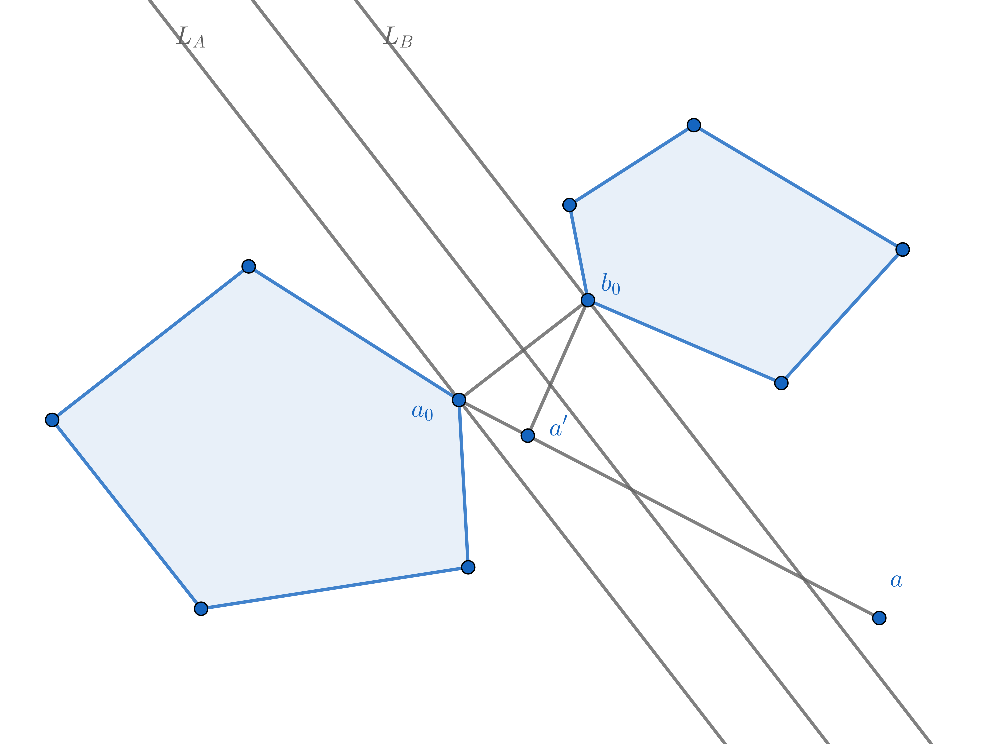

# 第1章：预备知识

*编辑：赵志民, J. Hu, 李一飞*

------

## 本章前言

强大数定律表明，当样本量足够大时，样本均值几乎必然收敛于总体的期望值。集中不等式则主要研究随机变量偏离其期望值的程度，常用于量化机器学习中经验误差与泛化误差之间的差异，从而评估模型处理新数据的能力。集中不等式是学习理论的重要分析工具，本节将列出机器学习理论研究中常用的集中不等式及其简要证明。

# 1.1 重要概念

## 1.1.1 范数

范数（norm）是数学中用于为向量空间中的每个非零向量分配严格正长度或大小的函数。几何上，范数可理解为向量的长度或大小。例如，绝对值是实数集上的一种范数。与之相对的是半范数（seminorm），它可以将非零向量赋予零长度。

向量空间上的半范数需满足以下条件：

1. **半正定性（非负性）**：任何向量的范数总是非负的，对于任意向量 $v$，$\|v\| \geq 0$。
2. **可伸缩性（齐次性）**：对于任意标量 $a$ 和任何向量 $v$，标量乘法 $av$ 的范数等于标量的绝对值乘以向量的范数，即 $\|av\| = |a|\|v\|$。
3. **次可加性（三角不等式）**：对于任何向量 $v$ 和 $w$，向量和 $u=v+w$ 的范数小于或等于向量 $v$ 和 $w$ 的范数之和，即 $\|v+w\| \leq \|v\| + \|w\|$。

范数在具备上述半范数特性的基础上，还要求：对于任意向量 $v$，若 $\|v\|=0$，则 $v$ 必须为零向量。换句话说，所有范数都是半范数，但它们可以将非零向量与零向量区分开来。

常用的向量范数包括：

1. **$\ell_0$ 范数**：向量 $x$ 中非零元素的个数，表示为 $\|x\|_0=\sum_{i=1}^n \mathbb{I}(x_i\neq 0)$。
2. **$\ell_1$ 范数**：向量 $x$ 中各元素绝对值之和，表示为 $\|x\|_1=\sum_{i=1}^n |x_i|$。
3. **$\ell_2$ 范数（欧几里得范数）**：向量 $x$ 各元素绝对值的平方和再开平方，表示为 $\|x\|_2=\sqrt{\sum_{i=1}^n x_i^2}$。
4. **$\ell_p$ 范数**：向量 $x$ 各元素绝对值的 $p$ 次方和再开 $p$ 次方，表示为 $\|x\|_p=(\sum_{i=1}^n |x_i|^p)^{\frac{1}{p}}$。
5. **$\ell_\infty$ 范数（极大范数）**：向量 $x$ 中各元素绝对值的最大值，表示为 $\|x\|_\infty=\max_{i=1,\cdots,n} |x_i|$。
6. **加权范数**：设 $A$ 为 $n$ 阶 Hermite 正定矩阵，则向量 $x$ 的加权范数定义为 $\|x\|_A=\sqrt{x^T A x}$。此类范数在本书第 8.3.2 和 8.4.2 节中经常使用。

## 1.1.2 凸集合

凸集合（convex set）是向量空间（如欧几里得空间）中的一个子集，对于集合中的任意两点，连接它们的线段完全位于该集合内。换句话说，若一个集合包含了连接集合内任意两点的线段上的所有点，则该集合是凸集合。

形式化地说，考虑向量空间 $\mathcal{V}$。若对于该空间中的任意两点 $x$ 和 $y$，以及满足 $\alpha\in[0,1]$ 的任意标量 $\alpha$，点 $\alpha x+(1-\alpha)y$ 也属于 $\mathcal{D}$，那么集合 $\mathcal{D}\subseteq\mathcal{V}$ 是凸集合。

凸集合具有非扩张性（non-expansiveness），即对于集合内的任意两点，连接这两点的线段完全包含在集合内。这种性质使得凸集合在许多数学环境中易于处理，特别是在优化问题中：在凸集合中找到的最小值或最大值必为全局值，没有局部最小值或最大值，从而简化了搜索过程。

不仅凸集合具有非扩张性，映射到凸集合的投影操作也是非扩张的，即两点在凸集合上的投影之间的距离不大于两点本身之间的距离。形式上，对于闭合凸集合 $K\subseteq\mathbb{R}^D$，投影算子 $\Pi:\mathbb{R}^D\rightarrow K$ 定义为：
$$
\begin{equation}
\Pi(x)=\arg \min_{y\in K} \| x-y\|_2
\end{equation}
$$
即将一个向量映射到最接近它的凸集合中的点。投影算子 $\Pi$ 在 $\ell_2$ 范数下是非扩张的，即对于任意 $x,x'\in\mathbb{R}^D$，有：
$$
\begin{equation}
\| \Pi(x) - \Pi(x')\|_2 \leq \| x - x'\|_2
\end{equation}
$$

该性质证明如下：  
令 $y=\Pi(x)$，易知 $x$ 和 $K$ 分处于通过 $y$ 的超平面 $H=\{z\in\mathbb{R}^D:\langle z-y,x-y\rangle=0\}$ 的两侧。因此，对于 $K$ 中的任意 $u$，有以下不等式成立：
$$
\begin{equation}
\langle x-y,u-y\rangle \leq 0
\end{equation}
$$
同理，令 $y'=\Pi(x')$，对于 $K$ 中的任意 $u'$，有以下不等式成立：
$$
\begin{equation}
\langle x'-y',u'-y'\rangle \leq 0
\end{equation}
$$
此时，令 $u=y'$ 且 $u'=y$，则有：
$$
\begin{equation}
\langle x-y,y'-y\rangle \leq 0 \\
\langle x'-y',y-y'\rangle \leq 0
\end{equation}
$$
将两个不等式相加可得：
$$
\begin{equation}
\langle (x-x')+(y'-y),y'-y\rangle \leq 0
\end{equation}
$$
根据 Cauchy-Schwarz 不等式，有：
$$
\begin{equation}
\begin{align*}
&\|y-y'\|_2^2 \leq \langle x-x',y-y'\rangle \leq \|x-x'\|_2\,\|y-y'\|_2\\
\Rightarrow &\|y-y'\|_2 \leq \|x-x'\|_2 \\
\Rightarrow &\|\Pi(x) - \Pi(x')\|_2 \leq \|x-x'\|_2
\end{align*}
\end{equation}
$$

这种投影映射经常用于凸优化中，因为它能将问题简化为凸优化问题，从而提高算法效率，并在许多情况下保证全局最优解。

## 1.1.3 Hessian 矩阵

Hessian 矩阵 $H_f$ 是由函数 $f(x)$ 的二阶偏导数组成的方阵，即：
$$
\begin{equation}
\mathbf H_f= \begin{bmatrix}
  \dfrac{\partial^2 f}{\partial x_1^2} & \dfrac{\partial^2 f}{\partial x_1\,\partial x_2} & \cdots & \dfrac{\partial^2 f}{\partial x_1\,\partial x_n} \\[2.2ex]
  \dfrac{\partial^2 f}{\partial x_2\,\partial x_1} & \dfrac{\partial^2 f}{\partial x_2^2} & \cdots & \dfrac{\partial^2 f}{\partial x_2\,\partial x_n} \\[2.2ex]
  \vdots & \vdots & \ddots & \vdots \\[2.2ex]
  \dfrac{\partial^2 f}{\partial x_n\,\partial x_1} & \dfrac{\partial^2 f}{\partial x_n\,\partial x_2} & \cdots & \dfrac{\partial^2 f}{\partial x_n^2}
\end{bmatrix}.
\end{equation}
$$
其中，$x=[x_1,x_2,\cdots,x_n]$。

## 1.1.4 凸函数

凸函数（convex function）是定义在凸集上的实值函数，满足以下性质：对于定义域内的任意两个点 $x$ 和 $y$ 以及满足 $\alpha\in[0,1]$ 的任意标量 $\alpha$，函数图像上这两点之间的线段位于或位于函数图像上方，即：
$$
\begin{equation}
f(\alpha x + (1-\alpha)y) \leq \alpha f(x) + (1-\alpha) f(y)
\end{equation}
$$
该不等式被称为凸性条件。

除了上述定义，凸函数还有以下几种等价的定义方式：

1. **一阶条件**：若一个定义在凸集上的函数 $f(x)$ 满足下述条件：
$$
\begin{equation}
f(y) \geq f(x) + \nabla f(x)^T(y - x)
\end{equation}
$$
其中，$\nabla f(x)$ 表示函数 $f(x)$ 在点 $x$ 处的梯度。几何上，这意味着函数的图像位于任意一点处的切线之上。

2. **二阶条件**：若函数 $f(x)$ 是二次可微的，则它是凸函数当且仅当其 Hessian 矩阵 $H_f$ 在其定义域内的所有点 $x$ 上都是半正定的（即矩阵的所有特征值均为非负）。

3. **Jensen 不等式**：若 $f(x)$ 是凸函数，则对于定义域内的任意一组点 ${x_1, x_2, \cdots, x_n}$ 和归一化的非负权重 ${w_1, w_2, \cdots, w_n}$，即 $\sum_{i=1}^n w_i=1$，有：
$$
\begin{equation}
f(\sum_{i=1}^n w_i x_i) \leq \sum_{i=1}^n w_i f(x_i)
\end{equation}
$$

4. **上图集定义**：凸函数与凸集合的概念密切相关。函数 $f$ 是凸函数，当且仅当其上图集（epigraph）是一个凸集。上图集是位于函数图像上方的点的集合，定义为：
$$
\begin{equation}
epi(f) = \{(x, y) | x \in dom(f)，y \geq f(x)\}
\end{equation}
$$
其中，$dom(f)$ 是函数 $f$ 的定义域。

凸函数的一些特性包括：

1. **正比例性质**：若函数 $f(x)$ 是凸函数，则对于任意常数 $\alpha \gt 0$，函数 $\alpha f(x)$ 也是凸函数。
2. **正移位性质**：若函数 $f(x)$ 是凸函数，则对于任意常数 $c \gt 0$，函数 $f(x) - c$ 也是凸函数。
3. **加法性质**：若 $f(x)$ 和 $g(x)$ 均为凸函数，则它们的和 $f(x) + g(x)$ 也是凸函数。

## 1.1.5 凹函数

凹函数（concave function）的定义与凸函数相反。对于其定义域内的任意两个点 $x$ 和 $y$ 以及满足 $\alpha\in[0,1]$ 的任意标量 $\alpha$，满足以下不等式：
$$
\begin{equation}
f(\alpha x + (1-\alpha)y) \geq \alpha f(x) + (1-\alpha) f(y)
\end{equation}
$$
此不等式被称为凹性条件。

其他定义与凸函数类似，这里不再赘述。值得注意的是，若函数 $f(x)$ 为凹函数，则 $-f(x)$ 为凸函数。因此，可以将凹函数问题转化为凸函数问题，从而利用凸函数的性质来求解凹函数问题。

## 1.1.6 强凸函数

对于定义在凸集上的函数 $f(x)$，若其满足以下性质，则称其为强凸函数：
$$
\begin{equation}
\forall x,y\in dom(f),\ \alpha\in[0,1],\ \exists \lambda \gt 0,\ \text{使得} \\
f(\alpha x + (1-\alpha)y) \leq \alpha f(x) + (1-\alpha)f(y) - \frac{\lambda}{2}\alpha(1-\alpha)\|x-y\|_2^2
\end{equation}
$$
此时，称 $f(x)$ 为 $\lambda$-强凸（strongly convex）函数，其中 $\lambda$ 为强凸系数。

强凸函数的其他等价定义包括：

1. **Hessian 矩阵条件**：若一个两次可微的函数 $f(x)$ 的 Hessian 矩阵 $H_f$ 在凸集中的所有 $x$ 处均为正定的（即矩阵的所有特征值为正），则该函数是强凸的。

2. **梯度条件**：若一个可微函数 $f(x)$ 是强凸的，则存在一个常数 $m$，使得对于凸集中的任意 $x,y$，有 $\|\nabla f(x) - \nabla f(y)\|_2 \geq m \|x - y\|_2$。其中，$\nabla f(x)$ 表示 $f(x)$ 在点 $x$ 处的梯度。

直观上，对于强凸函数 $f(x)$，可以在任意一点处构造一个二次函数作为其下界。这一性质使得优化算法更加高效，并具有类似于 **90页** 中定理 7.2 的良好性质。

以下给出定理 7.2 的证明：

根据强凸函数的定义，取 $x = w$，$y = w^*$，然后两边除以 $\alpha$，可得：
$$
\begin{equation}
\begin{align*}
&\frac{f(\alpha w + (1-\alpha)w^*)}{\alpha} \leq f(w) + \frac{1-\alpha}{\alpha}f(w^*) - \frac{\lambda}{2}(1-\alpha)\|w-w^*\|_2^2 \\
\Rightarrow &\frac{\lambda}{2}(1-\alpha)\|w-w^*\|_2^2 \leq f(w) - f(w^*) - \frac{f(w^* + (w-w^*)\alpha) - f(w^*)}{\alpha}
\end{align*}
\end{equation}
$$
令 $\alpha \rightarrow 0^+$，则有：
$$
\begin{equation}
\begin{align*}
&\lim_{\alpha\rightarrow 0^+}\frac{\lambda}{2}(1-\alpha)\|w-w^*\|_2^2 \leq f(w) - f(w^*) + \lim_{\alpha\rightarrow 0^+}\frac{f(w^* + (w-w^*)\alpha) - f(w^*)}{\alpha} \\
\Rightarrow &\frac{\lambda}{2}\|w-w^*\|_2^2 \leq f(w) - f(w^*) + \nabla f(w^*)^T(w-w^*)
\end{align*}
\end{equation}
$$
其中 $\Delta = (w-w^*)\alpha$。

由于 $w^*$ 为最优解，因此 $\nabla f(w^*) = 0$，则有：
$$
\begin{equation}
f(w) - f(w^*) \geq \frac{\lambda}{2}\|w-w^*\|_2^2
\end{equation}
$$

## 1.1.7 指数凹函数

若函数 $f(x)$ 的指数 $\exp(f(x))$ 为凹函数，则称 $f(x)$ 为指数凹（exponentially concave）函数。注意，当 $\exp(f(x))$ 是凹函数时，$f(x)$ 本身不一定是凹函数。
若 $f(x)$ 为指数凹函数，则 $\exp(-f(x))$ 必为凸函数。因此，指数凹是一种弱于强凸但强于凸的性质。

指数凹函数的一些特性包括：

1. **正比例性质**：若函数 $f(x)$ 为指数凹函数，则对于任意常数 $\alpha$，函数 $\alpha f(x)$ 也是指数凹函数。
2. **负移位性质**：若函数 $f(x)$ 为指数凹函数，且 $c$ 为常数，则函数 $f(x) - c$ 也是指数凹函数。

指数凹函数提供了一种灵活且富有表现力的方式来建模各种现象。它能捕捉广泛的形状和行为。例如，在凸优化中使用指数凹函数可以加快迭代优化算法（如梯度下降或牛顿法）的收敛速度。因此，指数凹函数在处理概率模型或存在不确定性的场景中具有重要意义，特别是在限制或量化不确定性方面。

## 1.1.8 凸优化

凸优化（convex optimization）是优化理论的一个分支，研究的是在凸函数的凸集上进行优化的问题。凸优化的目标是在满足一组凸约束条件的情况下，找到凸目标函数的最小值。

一般形式的凸优化问题可以表示为：
$$
\begin{equation}
\begin{align*}
&\min\ &f_0(x) \\
&s.t.\ &f_i(x) \leq 0, &i\in[m] \\
&\ &g_j(x) = 0, &j\in[n]
\end{align*}
\end{equation}
$$
其中，$f_0(x)$ 是凸目标函数，$f_i(x)$ 是凸不等式约束条件，$g_j(x)$ 是仿射等式约束条件。

凸优化具有以下有利特性，使其成为一个被广泛研究和应用的领域：

1. **全局最优性**：凸优化问题的一个关键性质是，任何局部最小值也是全局最小值。此性质确保凸优化算法找到的解是给定凸集中的最优解。

2. **高效算法**：凸优化拥有多项式时间内找到最优解的高效算法。这些算法基于凸目标函数和约束条件的凸性，能够有效解决复杂的优化问题。

3. **广泛应用**：凸优化在工程学、金融学、机器学习、运筹学和信号处理等领域有着广泛的应用。它被用于解决如投资组合优化、信号重构、资源分配和机器学习模型训练等问题。凸优化技术，如线性规划、二次规划和半定规划，构成了许多优化算法的基础，为高效解决复杂优化问题提供了强大工具。

以下证明凸函数任何局部最优解均为全局最优解的性质。

假设 $f(x)$ 是凸函数，$x^*$ 是 $f$ 在凸集合 $\mathcal{D}$ 中的局部最优解。由于凸集的性质，对于任意 $y$，$y-x^*$ 是一个可行方向。因此，总可以选择足够小的 $\alpha \gt 0$，使得：
$$
\begin{equation}
f(x^*) \leq f(x^* + \alpha(y-x^*))
\end{equation}
$$
由 $f$ 的凸性可得:
$$
\begin{equation}
f(x^* + \alpha(y-x^*)) = f((1-\alpha)x^* + \alpha y) \leq (1-\alpha)f(x^*) + \alpha f(y)
\end{equation}
$$
结合以上两式，可得：
$$
\begin{equation}
\begin{align*}
&f(x^*) \leq (1-\alpha)f(x^*) + \alpha f(y) \\
rightarrow &f(x^*) \leq f(y)
\end{align*}
\end{equation}
$$
由于 $y$ 是凸集合 $\mathcal{D}$ 中的任意点，故 $x^*$ 为全局最优解。对于 $f(x)$ 的全局最大解，可以通过考虑函数 $-f(x)$ 的局部最优解得到类似的结论。

## 1.1.9 仿射

仿射变换（Affine transformation），又称仿射映射，是指在几何中，对一个向量空间进行一次线性变换并加上一个平移，变换为另一个向量空间。若该线性映射被表示为矩阵 $A$，平移被表示为向量 $\vec{b}$，则仿射映射 $f$ 可表示为：
$$
\begin{equation}
\vec{y} = f(\vec{x}) = A\vec{x} + \vec{b}
\end{equation}
$$
其中，$A$ 被称为仿射变换矩阵或投射变换矩阵。

仿射变换具有以下性质：

1. **点之间的共线性**：在同一条直线上的三个或更多的点（即共线点）在变换后依然位于同一条直线上（共线）。
2. **直线的平行性**：两条或以上的平行直线在变换后仍保持平行。
3. **集合的凸性**：凸集合在变换后依然是凸集合，且最初的极值点被映射到变换后的极值点集。
4. **平行线段的长度比例恒定**：两条由点 $p_1, p_2, p_3, p_4$ 定义的平行线段，其长度比例在变换后保持不变，即 $\frac{\overrightarrow{p_1p_2}}{\overrightarrow{p_3p_4}} = \frac{\overrightarrow{f(p_1)f(p_2)}}{\overrightarrow{f(p_3)f(p_4)}}$。
5. **质心位置恒定**：不同质量的点组成集合的质心位置在仿射变换后保持不变。

仿射集（affine set）是指欧氏空间 $R^n$ 中具有以下性质的点集 $S$：对于任意 $x,y\in S$，以及 $\forall \lambda\in[0,1]$，有 $(1-\lambda)x+\lambda y\in S$。容易证明，包含原点的仿射集 $S$ 是 $R^n$ 的子空间。

仿射包（affine hull/span）是包含集合 $S$ 的所有仿射集的交集，也是集合 $S$ 中元素通过不断连接直线所形成的所有元素的集合。仿射包是包含集合 $S$ 的最小仿射集，记为 $aff(S)$，即：
$$
\begin{equation}
aff(S) = \{\sum_{i=1}^k \alpha_i x_i \mid k\gt0, x_i\in S, \alpha_i\in R, \sum_{i=1}^k \alpha_i = 1\}
\end{equation}
$$
仿射包具有以下性质：

1. $aff(aff(S)) = aff(S)$
2. $aff(S + T) = aff(S) + aff(T)$
3. 若 $S$ 为有限维度，则 $aff(S)$ 为闭集合。

## 1.1.10 Slater条件/定理

关于强对偶性的讨论，**11页** 已给出了详细说明，此处不再赘述。这里着重讨论 **11页** 左下角附注提到的 Slater 条件，即：

存在一点 $x\in \text{relint}(D)$，该点称为 Slater 向量，有：
$$
\begin{equation}
\begin{align*}
f_i(x) \lt 0, &\quad i\in[m]
\end{align*}
\end{equation}
$$
其中，$D = \bigcap_0^m \text{dom}(f_i)$，$relint(D)$ 为 $D$ 的相对内部，即其仿射包的内部所有点，即 $relint(D) = \text{int}(aff(D))$。

当满足 Slater 条件且原始问题为凸优化问题时：

1. 强对偶性成立。
2. 对偶最优解集合非空且有界。

这就是 Slater 定理。

### 证明

首先证明对偶间隙（Duality Gap）为零，即原始问题与对偶问题的目标函数值之差 $p^* - d^* = 0$。考虑集合 $\mathcal{V}\subset \mathbb{R}^m \times \mathbb{R}$，满足：
$$
\begin{equation}
\mathcal{V}:=\{(u,w)\in\mathbb{R}^m \times \mathbb{R} \mid f_0(x) \le w, f_i(x) \le u_i, \forall i\in[m], \forall x\}
\end{equation}
$$
集合 $\mathcal{V}$ 具有以下性质：

1. 它是凸集合，可由 $f_i,\ i\in\{0\}\cup[m]$ 的凸性质得出。
2. 若 $(u,w)\in\mathcal{V}$，且 $(u',w')\succeq(u,w)$，则 $(u',w')\in\mathcal{V}$。

易证向量 $(0,p^*)\notin int(\mathcal{V})$，否则一定存在 $\varepsilon \gt 0$，使得 $(0,p^*-\varepsilon)\in int(\mathcal{V})$，这明显与 $p^*$ 为最优解矛盾。因此，必有 $(0,p^*)\in \partial\mathcal{V}$ 或 $(0,p^*)\notin\mathcal{V}$。应用支撑超平面定理（定理 23），可知存在一个非零点 $(\lambda,\lambda_0)\in \mathbb{R}^m \times \mathbb{R}$，满足以下条件：
$$
\begin{equation}
(\lambda,\lambda_0)^T(u,w) = \lambda^Tu + \lambda_0w \ge \lambda_0p^*, \forall(u,w)\in\mathcal{V}
\end{equation}
$$
在此情况下，必然有 $\lambda \succeq 0$ 和 $\lambda_0 \geq 0$。这是因为，若 $\lambda$ 和 $\lambda_0$ 中的分量出现任何负数，根据集合 $\mathcal{V}$ 的性质二，$(u, w)$ 的分量可以在集合 $\mathcal{V}$ 内取得任意大的值，从而导致上式不一定成立。

因此，只需考虑两种情况：

1. **$\lambda_0 = 0$**：此时根据上式，可得
$$
\begin{equation}
\inf_{(u,w)\in\mathcal{V}}\lambda^Tu = 0
\end{equation}
$$
另一方面，根据 $\mathcal{V}$ 的定义，$\lambda\succeq 0$ 且 $\lambda \neq 0$，可得：
$$
\begin{equation}
\inf_{(u,w)\in\mathcal{V}}\lambda^Tu = \inf_{x}\sum_{i=1}^m \lambda_i f_i(x) \leq \sum_{i=1}^m \lambda_i f_i(\bar{x}) \lt 0
\end{equation}
$$
其中，$\bar{x}$ 是 Slater 向量，而最后一个不等式依据 Slater 条件得出。此时，两个结论互相矛盾，因此 $\lambda_0 \neq 0$。

2. **$\lambda_0 \gt 0$**：对上式左右两边除以 $\lambda_0$，得：
$$
\begin{equation}
\inf_{(u,w)\in\mathcal{V}}\{\tilde\lambda^Tu + w\} \ge p^*
\end{equation}
$$
其中，$\tilde\lambda := \frac{\lambda}{\lambda_0}\succeq 0$。

考虑拉格朗日函数 $L:\mathbb{R}^n \times \mathbb{R}^n \rightarrow \mathbb{R}$：
$$
\begin{equation}
L(x,\tilde\lambda) := f_0(x) + \sum_{i=1}^m \tilde\lambda_i f_i(x)
\end{equation}
$$
其对偶函数为：
$$
\begin{equation}
g(\tilde\lambda) := \inf_{x} L(x,\tilde\lambda) \ge p^*
\end{equation}
$$
其对偶问题为：
$$
\begin{equation}
\max_{\lambda} g(\lambda), \lambda\succeq 0
\end{equation}
$$
因此，可得 $d^* \geq p^*$。根据弱对偶性，$d^* \leq p^*$，从而推断出 $d^* = p^*$。

接着证明对偶问题最优解集合非空且有界。对于任意对偶最优解 $\tilde\lambda\succeq 0$，有：
$$
\begin{equation}
\begin{align*}
d^* = g(\tilde\lambda) &= \inf_{x} \{f_0(x) + \sum_{i=1}^m \tilde\lambda_i f_i(x)\} \\
&\leq f_0(\bar{x}) + \sum_{i=1}^m \tilde\lambda_i f_i(\bar{x}) \\
&\leq f_0(\bar{x}) + \max_{i\in[m]}\{f_i(\bar{x})\}[\sum_{i=1}^m \tilde\lambda_i]
\end{align*}
\end{equation}
$$
因此，有：
$$
\begin{equation}
\min_{i\in[m]}\{-f_i(\bar{x})\}[\sum_{i=1}^m \tilde\lambda_i] \leq f_0(\bar{x}) - d^*
\end{equation}
$$
进而得出：
$$
\begin{equation}
\|\tilde\lambda\| \leq \sum_{i=1}^m \tilde\lambda_i \leq \frac{f_0(\bar{x}) - d^*}{\min_{i\in[m]}\{-f_i(\bar{x})\}} \lt \infty
\end{equation}
$$
其中，最后一个不等式依据 Slater 条件得出。$\square$

## 1.1.11 KKT条件

KKT条件（Karush-Kuhn-Tucker条件）在凸优化领域具有至关重要的地位。虽然在**12-13页** 中对其进行了基本解释，此处将进行更为深入的分析。KKT条件中的符号 $\lambda_i,\ i\in[m]$ 和 $\mu_i,\ i\in[n]$ 被视为 KKT 乘子。特别地，当 $m=0$ 时，即不存在不等式约束条件时，KKT条件退化为拉格朗日条件，此时 KKT 乘子也被称为拉格朗日乘子。

### 证明

首先，对于 $x^*,(\mu^*,\lambda^*)$ 满足 KKT 条件等价于它们构成一个纳什均衡。

固定 $(\mu^*,\lambda^*)$，并变化 $x$，均衡等价于拉格朗日函数在 $x^*$ 处的梯度为零，即主问题的稳定性（stationarity）。

固定 $x$，并变化 $(\mu^*,\lambda^*)$，均衡等价于主问题的约束（feasibility）和互补松弛条件。

**充分性**：若解对 $x^*,(\mu^*,\lambda^*)$ 满足 KKT 条件，则它们构成一个纳什均衡，从而消除对偶间隙。

**必要性**：任意解对 $x^*,(\mu^*,\lambda^*)$ 必然消除对偶间隙，因此它们必须构成一个纳什均衡，从而满足 KKT 条件。$\square$

在此对 KKT 和 Slater 条件进行区分：

1. **KKT条件** 是一组用于确定约束优化问题中解的最优性的条件。它们通过将约束纳入条件，扩展了无约束优化中设定目标函数梯度为零的思路到约束优化问题中。  
   **Slater条件** 是凸优化中确保强对偶性的特定约束条件，即主问题和对偶问题最优解的等价性。

2. KKT条件包括对偶问题的约束、互补松弛条件、主问题约束和稳定性。它们整合了目标和约束函数的梯度以及 KKT 乘子，以形成最优性条件。  
   Slater 条件要求存在一个严格可行点，即严格满足所有不等式约束的点。

3. 当点满足 KKT 条件时，表明问题的局部最优解已找到。这些条件弥合了主问题和对偶问题之间的差距，对于分析和解决约束优化问题至关重要。  
   满足 Slater 条件时，确保凸优化问题的强对偶性，对于简化和解决这些问题至关重要。Slater 条件并不直接提供最优性条件，但为强对偶性铺平了道路，之后可以利用强对偶性寻找最优解。

4. **KKT条件** 较为通用，适用于更广泛的优化问题类别，包括非凸问题。  
   **Slater条件** 则特定于凸优化问题，用于确保这些问题中的强对偶性。

5. 对于凸且可微的问题，满足 KKT 条件意味着最优性和强对偶性。相反，最优性和强对偶性意味着所有问题的 KKT 条件得到满足。  
   当 Slater 条件成立时，KKT 条件是最优解的充要条件，此时强对偶性成立。

KKT条件和 Slater 条件通常被归类为“正则条件”（regularity condition）或“约束资格”（constraint qualification）。这些条件为优化问题提供了一个结构化的框架，以便在约束情况下分析和确定解的最优性。更多的正则条件详见参考文献：[On regularity conditions in mathematical programming](https://link.springer.com/chapter/10.1007/BFb0120988)。

## 1.1.12 偏序集

序理论（order theory）是研究捕捉数学排序直觉的各种二元关系的数学分支。在序理论中，一个偏序集（partial order set，简称 poset）包含一个非空集合 $P$ 和一个满足特定条件的二元关系 $\leq$。这个二元关系称为偏序关系，它必须满足以下三个条件：

1. **自反性（Reflexivity）**：对于 $P$ 中的任意元素 $a$，都有 $a \leq a$。
2. **反对称性（Antisymmetry）**：对于 $P$ 中的任意元素 $a$ 和 $b$，如果 $a \leq b$ 且 $b \leq a$，那么 $a = b$。
3. **传递性（Transitivity）**：对于 $P$ 中的任意元素 $a$、$b$ 和 $c$，如果 $a \leq b$ 且 $b \leq c$，那么 $a \leq c$。

这些条件定义了偏序关系，使其与全序（total order）关系不同。在偏序集中，可能存在某些元素是不可比较的，即对于 $P$ 中的某些 $a$ 和 $b$，既不满足 $a \leq b$，也不满足 $b \leq a$。

## 1.1.13 上下界

上界（upper bound 或 majorant）是与偏序集有关的特殊元素，指偏序集中大于或等于其子集中一切元素的元素。若数集 $S$ 为实数集 $R$ 的子集且有上界，则显然有无穷多个上界，其中最小的上界常常具有重要作用，称为数集 $S$ 的上确界（tight upper bound 或 supremum）。同理，可以定义下界（lower bound 或 minorant）和下确界（tight lower bound 或 infimum）。

## 1.1.14 尾界

**尾界（tail bound）**是指给定一个随机变量，其概率分布尾部部分的界限。上尾界（upper tail bound）描述随机变量在其分布上尾处的概率上限，而下尾界（lower tail bound）描述随机变量在其分布下尾处的概率上限。Chebyshev 不等式、Hoeffding 不等式和 Bernstein 不等式都是尾界的例子，它们提供了随机变量偏离其期望值的概率界限。

## 1.1.15 置信界

**置信界（confidence bound）**是在估计一个未知参数时，给出一个包含该参数的区间，并且这个区间具有特定的置信水平。例如，一个95%的置信区间意味着我们有95%的信心该区间包含真实的参数值。置信界可以是上置信界（upper confidence bound），下置信界（lower confidence bound），或同时包含上下界的置信区间（confidence interval）。上置信界提供对参数估计的可能最大值的上限，下置信界提供对参数估计的可能最小值的下限。

## 1.1.16 连续性

连续性（continuity）表示函数在某处的变化不会突然中断或跳跃。形式上，如果函数 $f(x)$ 在 $x = a$ 处满足以下条件，则称其在该点连续：

1. 函数 $f(x)$ 在 $x = a$ 处有定义。
2. 当 $x$ 趋近于 $a$ 时，$f(x)$ 的极限存在且等于 $f(a)$。

连续性意味着输入的微小变化导致输出的微小变化。如果一个函数在其定义域的每个点上都是连续的，则称其为连续函数。

Lipschitz 连续性是连续性的更强形式，它要求函数在变化速度方面有界。具体而言，如果存在一个常数 $L$，使得函数在任意两点的函数值之间的绝对差小于等于 $L$ 乘以两点之间的距离，则称该函数为 $L-Lipschitz$ 连续，即：
$$
\begin{equation}
\forall x,y\in \text{dom}(f),\ \exists L \gt 0\ \text{使得}\ \|f(x)-f(y)\|_2 \leq L\|x-y\|_2
\end{equation}
$$
其中，$L$ 称为 Lipschitz 常数，表示函数的最大变化率。若 $L$ 较大，函数可以快速变化；若 $L$ 较小，函数变化更渐进。

事实上，如果一个函数的导数有界，那么它一定是 Lipschitz 连续的；反之，如果一个可微函数是 Lipschitz 连续的，那么它的导数一定有界。

证明如下：

1. 若函数 $f(x)$ 的导数有界，即存在常数 $L \ge 0$，使得对于任意 $x$，有 $|f'(x)| \leq L$。根据微分中值定理，对于任意 $x \le y$，存在 $c \in [x,y]$，使得：
$$
\begin{equation}
\begin{align*}
&\|f(x)-f(y)\|_2 = \|f'(c)\|_2\|x-y\|_2 \\
\Rightarrow &\|f(x)-f(y)\|_2 \le L \|x-y\|_2
\end{align*}
\end{equation}
$$
此时，函数是 $L-Lipschitz$ 连续的。

2. 若函数 $f(x)$ 是 $L-Lipschitz$ 连续的，即对于任意 $x,y$，有
$$
\begin{equation}
\|f(x)-f(y)\|_2 \le L\|x-y\|_2
\end{equation}
$$
根据微分中值定理，对于任意 $x \le y$，存在 $c \in [x,y]$，使得：
$$
\begin{equation}
\|f(x)-f(y)\|_2 = \|f'(c)\|_2\|x-y\|_2
\end{equation}
$$
不妨令 $x \rightarrow y$，则 $c \rightarrow y$。因为 $f(y)$ 可微，可得：
$$
\begin{equation}
\|f'(y)\|_2 = \|\lim_{x \rightarrow y}\frac{f(x)-f(y)}{x-y}\|_2 = \lim_{x \rightarrow y}\frac{\|f(x)-f(y)\|_2}{\|x-y\|_2} \le \lim_{x \rightarrow y} L = L
\end{equation}
$$
因为 $y$ 的任意性，所以函数的导数有界。

连续性关注函数图像中跳跃或中断的缺失，而 Lipschitz 连续性关注函数的变化速度。因此，Lipschitz 连续性是比连续性更严格的条件。一个连续函数不一定是 Lipschitz 连续的，因为连续性不要求函数变化速度有界。然而，一个 Lipschitz 连续的函数必然是连续的，因为 Lipschitz 连续性蕴含连续性。

Lipschitz 连续性的性质在数学的各个领域中广泛应用，如分析、优化和微分方程研究。它在保证某些数学问题的解的存在性、唯一性和稳定性方面起着关键作用。

## 1.1.17 光滑性

在数学分析中，函数的光滑性（smoothness）通过函数在某个域（称为可微性类）上的连续导数的数量来衡量。最基本的情况下，如果一个函数在每个点上都可导（因此连续），则可以认为它是光滑的。
一方面，光滑性确保了梯度下降等优化算法能够更快收敛，并减少可能遇到的梯度震荡或发散的情况。
另一方面，光滑性提供了函数曲率的信息，从而帮助设计更有效的优化算法，如加速梯度下降法或牛顿法。

在优化理论中，$L$-光滑函数是指它的梯度具有 $L$-Lipschitz 连续性，这意味着函数的梯度在其定义域中的变化速率被 $L$ 所限制。
形式上，对于任意 $x,y \in \mathbb{R}^n$，存在 $L \gt 0$，使得：
$$
\begin{equation}
\|\nabla f(x) - \nabla f(y)\|_2 \leq L \|x - y\|_2
\end{equation}
$$
或者等价地，
$$
\begin{equation}
\|\nabla^2 f(x)\|_2 \leq L
\end{equation}
$$
或者等价地，
$$
\begin{equation}
f(y) \leq f(x) + \langle \nabla f(x), y - x \rangle + \frac{L}{2}\|y - x\|_2^2
\end{equation}
$$
以上三种定义方式是等价的，且 $L$ 被称为光滑系数。
由定义3，我们可以看出，在光滑函数的任意一点处都可以构造一个二次函数作为其上界。

接下来我们证明这些定义的等价性。首先，我们证明定义1可以推导出定义2。

考虑函数 $f$ 的梯度 $\nabla f(x)$ 的二阶泰勒展开：
$$
\begin{equation}
\nabla f(y) = \nabla f(x) + \nabla^2 f(\xi)(y - x)
\end{equation}
$$
其中 $\xi$ 是 $x$ 和 $y$ 之间的一点，$\nabla^2 f(\xi)$ 表示在点 $\xi$ 处的 Hessian 矩阵。

根据 $L$-光滑性的定义1，我们有：
$$
\begin{equation}
\|\nabla f(y) - \nabla f(x)\|_2 \leq L \|y - x\|_2
\end{equation}
$$

将二阶泰勒展开的结果代入其中：
$$
\begin{equation}
\|\nabla^2 f(\xi)(y - x)\|_2 \leq L \|y - x\|_2
\end{equation}
$$

对于任意的非零向量 $v = y - x$，定义：
$$
\begin{equation}
v' = \frac{v}{\|v\|_2}
\end{equation}
$$
我们得到：
$$
\begin{equation}
\|\nabla^2 f(\xi) v'\|_2 \leq L
\end{equation}
$$

由于 $v'$ 是一个单位向量，这意味着 Hessian 矩阵 $\nabla^2 f(\xi)$ 作用在任意单位向量上时的范数不超过 $L$，因此 Hessian 矩阵的谱范数（即最大特征值的绝对值）满足：
$$
\begin{equation}
\|\nabla^2 f(\xi)\|_2 \leq L
\end{equation}
$$
其中，由于 $\xi$ 是 $x$ 和 $y$ 之间的一点，因此我们可以将上述结论推广到整个定义域。

接下来我们证明定义2可以推导出定义3。由定义2，给定 $f$ 是 $L$-光滑的，对任意的 $x, y \in \mathbb{R}^n$，我们有：
$$
\begin{equation}
f(y) \leq f(x) + \langle \nabla f(x), y - x \rangle + \frac{L}{2} \|y - x\|_2^2
\end{equation}
$$

将定义中的 $x$ 和 $y$ 互换，得到：
$$
\begin{equation}
f(x) \leq f(y) + \langle \nabla f(y), x - y \rangle + \frac{L}{2} \|x - y\|_2^2
\end{equation}
$$

将两个不等式相加可得：
$$
\begin{equation}
\langle \nabla f(x) - \nabla f(y), x - y \rangle \leq L \|x - y\|_2^2
\end{equation}
$$

注意到不等式左侧的内积无论如何取值，该不等式均成立。
根据 Cauchy-Schwarz 不等式，当 $y - x$ 与 $\nabla f(x) - \nabla f(y)$ 平行时左侧内积取到最大值，即 $\|\nabla f(x) - \nabla f(y)\|_2 \|x - y\|_2$，代入可得：
$$
\begin{equation}
\|\nabla f(x) - \nabla f(y)\|_2 \|x - y\|_2 \leq L \|x - y\|_2^2
\end{equation}
$$
化简后即得证。

这里对光滑性和 $Lipschitz$ 连续性进行一些比较：
- $Lipschitz$ 连续性关注的是函数值变化的速度，即函数值的“陡峭程度”，而光滑性关注的是梯度变化的速度，即函数的“曲率”或二阶变化。
- $Lipschitz$ 连续性表示函数变化不会太快，确保函数的整体平滑性，而光滑性表示梯度变化不会太快，确保函数曲面没有急剧的弯曲。

## 1.1.18 次梯度

次梯度（subgradient）是凸函数导数的推广形式。某些凸函数在特定区域内可能不存在导数，但我们依旧可以用次梯度来表示该区域内函数变化率的下界。形式上，对于凸函数 $f(x)$，在任意点 $x_0$ 处的次梯度 $c$ 必须满足以下不等式：
$$
\begin{equation}
f(x) - f(x_0) \geq c(x - x_0)
\end{equation}
$$
根据微分中值定理的逆命题，$c$ 通常在 $[a,b]$ 之间取值，其中 $a,b$ 是函数 $f(x)$ 在 $x_0$ 处的左右导数，即：
$$
\begin{equation}
a = \lim_{x \rightarrow x_0^-}\frac{f(x) - f(x_0)}{x - x_0},\ b = \lim_{x \rightarrow x_0^+}\frac{f(x) - f(x_0)}{x - x_0}
\end{equation}
$$
此时，次梯度 $c$ 的集合 $[a,b]$ 被称为次微分，即 $\partial f(x_0)$。当 $a = b$ 时，次梯度 $c$ 退化为导数。

次梯度在机器学习领域广泛应用，特别是在训练支持向量机（SVM）和其他具有非可微损失函数的模型中。它们还构成了随机次梯度方法的基础，这些方法在处理大规模机器学习问题时非常有效。

## 1.1.19 对偶空间

线性泛函（linear functional）是指从向量空间 $V$ 到对应标量域 $k$ 的线性映射，满足加法和数乘的性质，即对于任意向量 $x,y \in V$ 和标量 $\alpha \in k$，有：
$$
\begin{equation}
\begin{align*}
&f(x+y) = f(x) + f(y) \\
&f(\alpha x) = \alpha f(x)
\end{align*}
\end{equation}
$$
所有从 $V$ 到 $k$ 的线性泛函构成的集合称为 $V$ 的对偶空间（dual space），记为 $V^* = \text{Hom}_k(V,k)$，对偶空间中的元素称为对偶向量。

## 1.1.20 Legendre变换

将函数转换为另一种函数，常用于改变其定义域和属性，使问题更简单或更易分析。Legendre 变换（Legendre transform）常用于将一组独立变量转换为另一组独立变量，特别是在经典力学和热力学中。以下是 Legendre 变换的基本概念和步骤：

1. **定义函数**：假设有一个凸函数 $f(x)$，其自变量为 $x$。
2. **定义共轭变量**：定义新的变量 $p$，它是原函数 $f(x)$ 的导数，即 $p = \frac{d f(x)}{dx}$。
3. **定义共轭函数**：定义新的函数 $g(p)$，其形式为：$g(p) = x \cdot p - f(x)$。这里，$x$ 是 $f(x)$ 的自变量，同时也是 $g(p)$ 的隐含变量。
4. **变换关系**：通过 Legendre 变换，从原来的函数 $f(x)$ 得到新的函数 $g(p)$，这个新的函数 $g(p)$ 依赖于共轭变量 $p$。

## 1.1.21 共轭函数

凸共轭（convex conjugate）是 Legendre 变换的一种推广，因此也被称为 Legendre-Fenchel 变换（Legendre-Fenchel transform）。通过凸共轭变换，原函数可以转换为凸函数，从而利用凸函数的性质来解决原问题。

形式上，对于函数 $f(x)$，其共轭函数 $f^*(y)$ 定义为：
$$
\begin{equation}
f^*(y) = \sup_{x \in \text{dom}(f)}(y^T x - f(x))
\end{equation}
$$
其中，$\text{dom}(f)$ 是函数 $f(x)$ 的定义域。

共轭函数具有以下一些有用的性质：

1. **凸性**：函数 $f(x)$ 的共轭函数 $f^*(y)$ 一定是凸函数。证明如下：
$$
\begin{equation}
\begin{align*}
f^*(\lambda y_1+(1-\lambda)y_2) &= \sup_{x\in \text{dom}(f)}\{x^T(\lambda y_1+(1-\lambda)y_2)-f(x)\}\\
&\leq \lambda \sup_{x\in \text{dom}(f)}\{x^T y_1 - f(x)\} + (1-\lambda)\sup_{x\in \text{dom}(f)}\{x^T y_2 - f(x)\}\\
&= \lambda f^*(y_1) + (1-\lambda)f^*(y_2)
\end{align*}
\end{equation}
$$
其中的不等式利用了凸性的性质。

2. **逆序性**：对于定义域中所有元素 $x$，若 $f(x) \leq g(x)$，则 $f^*(y) \geq g^*(y)$。证明如下：

由于 $f(x) \leq g(x)$，因此 $x^T y - f(x) \geq x^T y - g(x)$。两边同时取上确界，根据定义有：
$$
\begin{equation}
f^*(y) = \sup_{x\in \text{dom}(f)}\{x^T y - f(x)\} \geq \sup_{x\in \text{dom}(f)}\{x^T y - g(x)\} = g^*(y)
\end{equation}
$$

3. **极值变换**：若 $f$ 可微，则对于 $\forall y$，有：
$$
\begin{equation}
f^*(y) \leq f^*(\nabla f(x)) = \nabla f^*(x)^T x - f(x) = -[f(x) + \nabla f(x)^T(0 - x)]
\end{equation}
$$
此性质即书中的（1.10），完整证明如下：

为了在 $f^*$ 的定义中找到上确界，对右侧的 $x$ 求导，并将其设置为零以找到极大值点：
$$
\begin{equation}
\frac{d}{dx}(x^T y − f(x)) = y − \nabla f(x) = 0
\end{equation}
$$
此时有 $y = \nabla f(x)$，得证。

## 1.1.22 σ-代数

σ-代数（或 σ-域）是测度论和概率论中的一个重要概念。σ-代数是一个满足特定封闭性质的集合族，使我们能够对这些集合定义一致的测度（如概率）。具体来说，σ-代数是一个集合族，满足以下三个性质：

1. **包含全集**：如果 $\mathcal{F}$ 是定义在集合 $X$ 上的一个 σ-代数，那么 $X$ 本身属于 $\mathcal{F}$，即 $X \in \mathcal{F}$。
2. **对补集封闭**：如果 $A$ 是 $\mathcal{F}$ 中的一个集合，那么它的补集 $X \setminus A$ 也属于 $\mathcal{F}$，即 $A \in \mathcal{F} \implies X \setminus A \in \mathcal{F}$。
3. **对可数并封闭**：如果 $A_1, A_2, A_3, \ldots$ 是 $\mathcal{F}$ 中的集合，那么它们的可数并集 $\bigcup_{i=1}^{\infty} A_i$ 也属于 $\mathcal{F}$，即 $A_i \in \mathcal{F}$ 对所有 $i \in \mathbb{N}$，则 $\bigcup_{i=1}^{\infty} A_i \in \mathcal{F}$。

σ-代数在测度论中尤为重要，因为它为定义测度提供了必要的框架。测度是定义在 σ-代数上的集合函数，用于度量集合的“大小”。在概率论中，σ-代数用于定义事件空间，从而定义概率测度。

### 过滤

σ-代数 $\mathcal{F}$ 是一个固定的集合族，满足特定的封闭性质，表示我们在某一时刻可以知道的所有信息。过滤（filtration）是关于随着时间推移而观察信息的概念，通常与随机过程（stochastic processes）相关。具体来说，过滤是一个按时间参数索引的 σ-代数序列 $\{\mathcal{F}_t\}_{t \in T}$，表示随时间变化的可观测事件的集合，满足以下性质：

1. **每个 $\mathcal{F}_t$ 是一个 σ-代数**：对于每个时刻 $t$，$\mathcal{F}_t$ 是定义在某个固定集合 $X$ 上的一个 σ-代数。
2. **单调性**：对于任意的 $t_1 \leq t_2$，有 $\mathcal{F}_{t_1} \subseteq \mathcal{F}_{t_2}$。这意味着随着时间的推移，所包含的信息只会增加，不会减少。

## 1.1.23 鞅

鞅（Martingale）是概率论中的一个重要概念，用于描述某些类型的随机过程。鞅过程的特点是，其未来期望值在已知当前信息的条件下等于当前值。

### 形式化定义

设 $\{X_t\}$ 是一个随机过程，$\{\mathcal{F}_t\}$ 是一个随时间 $t$ 变化的过滤（即包含随时间增加的所有信息的 σ-代数的序列）。当这个随机过程 $\{X_t\}$ 是鞅时，必须满足以下条件：

1. **适应性（Adaptedness）**：对于每一个 $t$，$X_t$ 是 $\mathcal{F}_t$-可测的（即 $X_t$ 的值在时间 $t$ 时刻是已知信息的函数）。
2. **积分性（Integrability）**：对于所有 $t$，$\mathbb{E}[|X_t|] \lt \infty$。
3. **鞅性质（Martingale Property）**：对于所有 $t$ 和 $s \geq t$，有 $\mathbb{E}[X_s \mid \mathcal{F}_t] = X_t$。这意味着在已知当前时刻 $t$ 的信息 $\mathcal{F}_t$ 条件下，未来某个时刻 $s$ 的期望值等于当前时刻 $t$ 的值。

### 直观解释

鞅的定义保证了在已知当前信息的条件下，未来值的期望等于当前值，这反映了一种“无偏性”。因此，鞅过程可以被看作是一种“公平游戏”。设想一个赌徒在赌场中进行赌博，如果这个赌徒的资金变化形成一个鞅过程，那么在任何时刻，给定当前的资金情况，未来资金的期望值都是当前的资金，表示没有系统性的赢或输的趋势。

### 举例说明

考虑一个简单的随机游走过程，其中 $X_{t+1} = X_t + Z_{t+1}$，其中 $Z_{t+1}$ 是一个独立同分布的随机变量，取值为 $+1$ 或 $-1$，且概率各为 $50\%$。在这种情况下，如果设 $X_0 = 0$，那么 $\{X_t\}$ 是一个鞅，因为每一步的期望值都是零。

### 鞅的类型

除了标准的鞅，还有两个相关的概念：

1. **超鞅（Submartingale）**：若对于所有 $t$ 和 $s \geq t$，有 $\mathbb{E}[X_s \mid \mathcal{F}_t] \geq X_t$，则称 $\{X_t\}$ 为超鞅（或上鞅）。
2. **亚鞅（Supermartingale）**：若对于所有 $t$ 和 $s \geq t$，有 $\mathbb{E}[X_s \mid \mathcal{F}_t] \leq X_t$，则称 $\{X_t\}$ 为亚鞅（或下鞅）。

一个区分超鞅和亚鞅的记忆方法是：“生活是一个超鞅：随着时间的推进，期望降低。”

### 鞅差序列

鞅差 $D_t$ 定义为 $D_t = X_t - X_{t-1}$，鞅差序列（Martingale Difference Sequence）$\{D_t\}$ 则满足以下条件：

1. **适应性（Adaptedness）**：对于每一个 $t$，$D_t$ 是 $\mathcal{F}_t$-可测的。
2. **零条件期望（Zero Conditional Expectation）**：对于所有 $t$，有 $\mathbb{E}[D_t \mid \mathcal{F}_{t-1}] = 0$，即在已知过去信息 $\mathcal{F}_{t-1}$ 的条件下，$D_t$ 的条件期望为零。这意味着当前的观察值不提供对未来观察值的系统性偏差，即每一步的变化是纯随机的。

虽然鞅差序列中的每个元素的条件期望为零，但这并不意味着这些元素是独立的。相反，它们可以有复杂的依赖关系。鞅差序列的关键性质是每个元素在条件期望下为零，这使得它在分析鞅和集中不等式（如 Bernstein 不等式）中非常有用。

## 1.1.24 KL 散度

KL 散度（Kullback-Leibler 散度），也称为相对熵，是一种用于衡量两个概率分布之间差异的非对称度量，在信息论和统计学中广泛应用。KL 散度衡量的是在使用近似分布时，相比于使用真实分布，所增加的“信息损失”或“不确定性”。

### 定义

假设有两个概率分布 $P$ 和 $Q$，它们定义在同一个概率空间上。$P$ 通常被认为是“真实”分布，而 $Q$ 是近似分布。KL 散度 $D_{KL}(P \| Q)$ 表示为：
$$
\begin{equation}
D_{KL}(P \| Q) = \sum_{x} P(x) \ln \frac{P(x)}{Q(x)}
\end{equation}
$$
对于连续分布：
$$
\begin{equation}
D_{KL}(P \| Q) = \int_{-\infty}^{+\infty} p(x) \ln \frac{p(x)}{q(x)} \, dx
\end{equation}
$$
其中，$P(x)$ 和 $Q(x)$ 分别是分布 $P$ 和 $Q$ 在 $x$ 处的概率密度函数（或概率质量函数）。

### 性质

1. **非负性**：KL 散度总是非负的，即 $D_{KL}(P \| Q) \geq 0$，只有当 $P$ 和 $Q$ 完全相同时，KL 散度才为零。

### 非负性的证明

KL 散度的非负性可以通过 Jensen 不等式来证明。首先，考虑离散情况下的 KL 散度定义：
$$
\begin{equation}
D_{KL}(P \| Q) = \sum_{x} P(x) \ln \frac{P(x)}{Q(x)}
\end{equation}
$$
由于对数函数是一个凹函数，可以应用 Jensen 不等式。对于凹函数 $f$ 和随机变量 $X$，有：
$$
\begin{equation}
f(\mathbb{E}[X]) \geq \mathbb{E}[f(X)]
\end{equation}
$$

将 $f(x) = \ln(x)$，并令 $X = \frac{Q(x)}{P(x)}$。则有：
$$
\begin{equation}
\ln(\mathbb{E}[\frac{Q(x)}{P(x)}]) \geq \mathbb{E}[\ln(\frac{Q(x)}{P(x)})]
\end{equation}
$$

因为 $\sum_{x} P(x) = 1$ 且 $Q(x) \geq 0$，所以：
$$
\begin{equation}
\mathbb{E}[\frac{Q(x)}{P(x)}] = \sum_{x} P(x) \frac{Q(x)}{P(x)} = \sum_{x} Q(x) = 1
\end{equation}
$$

于是，有：
$$
\begin{equation}
0 = \ln(1) \geq \sum_{x} P(x) \ln(\frac{Q(x)}{P(x)})
\end{equation}
$$
即：
$$
\begin{equation}
D_{KL}(P \| Q) = \sum_{x} P(x) \ln(\frac{P(x)}{Q(x)}) \geq 0
\end{equation}
$$

2. **非对称性**：$D_{KL}(P \| Q) \neq D_{KL}(Q \| P)$，即 KL 散度不是对称的，交换 $P$ 和 $Q$ 一般会导致不同的结果。

### 应用

- **机器学习**：在训练过程中，KL 散度常用于优化目标函数，例如变分自编码器（VAE）和生成对抗网络（GAN）。通过最小化 KL 散度，可以使近似分布 $Q$ 尽可能接近真实分布 $P$，从而提高模型的准确性和效率。
- **信息论**：用于测量编码方案的效率，评估数据压缩方案等。
- **统计学**：用于假设检验和模型选择。

## 1.1.25 先验和后验

先验（Prior）和后验（Posterior）是贝叶斯统计中的两个核心概念，用于描述不确定性和信息更新的过程。

### 先验概率（Prior Probability）

**定义**：先验概率是指在获得新数据之前，根据已有的知识或经验对某一事件或参数的初始估计。先验概率反映了在观察到新数据之前，我们对某一事件或参数的不确定性。

**表示方法**：用 $P(\theta)$ 表示，其中 $\theta$ 代表参数或事件。

**作用**：先验概率提供了一个起点，在进行贝叶斯推断时，它与新的数据结合，更新我们的认知。

### 后验概率（Posterior Probability）

**定义**：后验概率是指在获得新数据之后，根据贝叶斯定理更新的某一事件或参数的概率分布。后验概率反映了在观察到新数据之后，我们对某一事件或参数的不确定性。

**表示方法**：用 $P(\theta \mid D)$ 表示，其中 $\theta$ 代表参数或事件， $D$ 代表新观察到的数据。

**计算方法**：根据贝叶斯定理，后验概率可以通过先验概率、似然函数和边际似然计算得到：
$$
\begin{equation}
P(\theta \mid D) = \frac{P(D \mid \theta) P(\theta)}{P(D)}
\end{equation}
$$
其中：
- $P(\theta \mid D)$ 是后验概率。
- $P(D \mid \theta)$ 是似然函数，表示在给定参数 $\theta$ 时观察到数据 $D$ 的概率。
- $P(\theta)$ 是先验概率。
- $P(D)$ 是边际似然，表示观察到数据 $D$ 的总体概率。

## 1.1.26 拓扑向量空间

拓扑向量空间（Topological Vector Space，简称 TVS）是一个定义在拓扑域 $\mathbb{K}$（通常是带有标准拓扑的实数或复数）上的向量空间，该空间被赋予了一个拓扑结构，使得向量加法 $\cdot\, + \,\cdot\; : X \times X \to X$ 和标量乘法 $\cdot : \mathbb{K} \times X \to X$ 是连续函数（这些函数的定义域赋予了乘积拓扑）。这样的拓扑被称为 $X$ 上的**向量拓扑**或**TVS 拓扑**。

拓扑向量空间是数学分析和函数空间理论中的重要概念，它们将向量空间的代数结构与拓扑空间的结构相结合，从而使我们能够更好地理解向量空间中的连续性和收敛性。

## 1.1.27 超平面

超平面（Hyperplane）是指一个比所在拓扑向量空间少一维的平滑仿射子空间。  
半空间（Half Space）是指拓扑向量空间被超平面划分出的两个区域之一。

假设有一个超平面，其由以下方程定义：
$$
\begin{equation}
\mathbf{n} \cdot \mathbf{x} = c
\end{equation}
$$
其中，$\mathbf{n}$ 是垂直于超平面的法向量，$\mathbf{x}$ 是空间中的一个点，$c$ 是一个常数。

两个半空间分别由以下不等式定义：
$$
\begin{equation}
\mathbf{n} \cdot \mathbf{x} \geq c
\end{equation}
$$
和
$$
\begin{equation}
\mathbf{n} \cdot \mathbf{x} \leq c
\end{equation}
$$
这些不等式中的每一个代表了超平面两侧的一个半空间，满足其中一个不等式的点位于相应的半空间中。

## 1.1.28 紧空间

紧空间（Compact Space）在数学中是一种具有特殊性质的空间，即它在某种意义上表现得像“有限的”，即使它可能看起来非常大，甚至是无限的。

一个空间被称为紧致的，如果可以用有限数量的小而重叠的片段完全覆盖整个空间。换句话说，即使这个空间本身可能非常大或无限大，但紧致性意味着总能用有限数量的部分来描述它的全貌。

紧空间可以理解为一种“有限”或“被包含”的空间。这种空间不会让你“无限延伸”，而是会将你限制在某个范围内。想象你在一个小岛上，无论你走到哪里，总会遇到岛的边缘——你不能无限制地前进，总有一个尽头。这类似于紧空间。

相反地，如果你在一片无边无际的沙漠中，可以一直走下去而永远不会到达尽头，这类似于非紧空间。在紧空间中，总有一种“有限”的感觉，而在非紧空间中，感觉像是没有尽头的延伸。

## 1.1.29 Taylor展开

**Taylor展开**（Taylor Expansion）是用多项式来近似一个函数的工具。它表示一个函数在某一点附近的值为该函数在该点的导数信息的线性组合，从而通过简单的多项式来逼近复杂的函数。

### 定义：
给定一个在某点 $a$ 处可导多次的函数 $f(x)$，它的 **Taylor 展开** 在点 $a$ 处的表达式为：

$$
\begin{equation}
f(x) = f(a) + f'(a)(x - a) + \frac{f''(a)}{2!}(x - a)^2 + \frac{f^{(3)}(a)}{3!}(x - a)^3 + \dots + \frac{f^{(n)}(a)}{n!}(x - a)^n + R_n(x)
\end{equation}
$$

其中：
- $f^{(n)}(a)$ 表示函数 $f(x)$ 在点 $a$ 处的第 $n$ 阶导数，
- $R_n(x)$ 是剩余项（余项），它表示截断后，未被包含的误差部分。

当 $x$ 足够接近 $a$ 时，截取足够多项的 Taylor 展开可以非常准确地逼近函数值。

### 特殊情况：麦克劳林（Maclaurin）展开
当 $a = 0$ 时，Taylor 展开被称为 **麦克劳林展开**，形式为：

$$
\begin{equation}
f(x) = f(0) + f'(0)x + \frac{f''(0)}{2!}x^2 + \frac{f^{(3)}(0)}{3!}x^3 + \dots
\end{equation}
$$

### 例子：
1. **指数函数的 Taylor 展开**（以 $a = 0$ 为例，即 麦克劳林展开）：
   $$
   \begin{equation}
   e^x = 1 + x + \frac{x^2}{2!} + \frac{x^3}{3!} + \dots
   \end{equation}
   $$

2. **正弦函数的 Taylor 展开**（在 $a = 0$ 处）：
   $$
   \begin{equation}
   \sin(x) = x - \frac{x^3}{3!} + \frac{x^5}{5!} - \dots
   \end{equation}
   $$

通过 Taylor 展开，我们可以在某个点附近用有限项多项式来近似复杂的函数。这在数值计算和分析中非常有用。

# 1.2 重要定理

设 $X$ 和 $Y$ 是随机变量，$\mathbb{E}[X]$ 表示 $X$ 的数学期望，$\mathbb{V}[X]$ 表示 $X$ 的方差。

定理 1.2.8 到 1.2.18 统称为集中不等式（Concentration Inequalities），这些定理给出了随机变量偏离某一值（通常是期望值）的界限。经典概率论中的大数定律指出，样本数量越多，其算术平均值越有可能接近期望值。

## 1.2.1 Jensen 不等式

对于任意凸函数 $f$，则有：
$$
\begin{equation}
f(\mathbb{E}[X]) \leq \mathbb{E}[f(X)]
\end{equation}
$$
成立。

### 证明

设 $p(x)$ 为 $X$ 的概率密度函数。由 Taylor 展开式及 $f$ 的凸性，可知 $\exists \xi$ 使得：
$$
\begin{equation}
\begin{align*}
f(x) &= f(\mathbb{E}[X]) + f^{\prime}(\mathbb{E}[X])(x-\mathbb{E}[X]) + \frac{f^{\prime \prime}(\xi)}{2}(x-\mathbb{E}[X])^{2} \\
& \geq f(\mathbb{E}[X]) + f^{\prime}(\mathbb{E}[X])(x-\mathbb{E}[X])
\end{align*}
\end{equation}
$$
对上式取期望，得到：
$$
\begin{equation}
\begin{align*}
\mathbb{E}[f(X)] &= \int p(x) f(x) \,dx \\
&\geq f(\mathbb{E}[X]) \int p(x) \,dx + f^{\prime}(\mathbb{E}[X]) \int p(x)(x-\mathbb{E}[X]) \,dx \\
&= f(\mathbb{E}[X])
\end{align*}
\end{equation}
$$
因此，原不等式得证。

如果 $f$ 是凹函数，则 Jensen 不等式变为：
$$
\begin{equation}
f(\mathbb{E}[X]) \geq \mathbb{E}[f(X)]
\end{equation}
$$
这一结论可以通过将上述证明中的 $f$ 替换为 $-f$ 得到。$\square$

## 1.2.2 Hölder 不等式

对于任意 $p, q \in \mathbb{R}^{+}$，且满足 $\frac{1}{p} + \frac{1}{q} = 1$，则有：
$$
\begin{equation}
\mathbb{E}[|XY|] \leq (\mathbb{E}[|X|^p])^{\frac{1}{p}} (\mathbb{E}[|Y|^q])^{\frac{1}{q}}
\end{equation}
$$
成立。

### 证明

设 $f(x)$ 和 $g(y)$ 分别为 $X$ 和 $Y$ 的概率密度函数，定义：
$$
\begin{equation}
M = \frac{|x|}{(\int_X |x|^p f(x) \,dx)^{\frac{1}{p}}}, \quad N = \frac{|y|}{(\int_Y |y|^q g(y) \,dy)^{\frac{1}{q}}}
\end{equation}
$$
代入 Young 不等式：
$$
\begin{equation}
MN \leq \frac{1}{p}M^p + \frac{1}{q}N^q
\end{equation}
$$
对该不等式两边同时取期望：
$$
\begin{equation}
\begin{align*}
\frac{\mathbb{E}[|XY|]}{(\mathbb{E}[|X|^p])^{\frac{1}{p}} (\mathbb{E}[|Y|^q])^{\frac{1}{q}}} &= \frac{\int_{XY} |xy| f(x)g(y) \,dx\,dy}{(\int_X |x|^p f(x) \,dx)^{\frac{1}{p}} (\int_Y |y|^q g(y) \,dy)^{\frac{1}{q}}} \\
&\leq \frac{\int_X |x|^p f(x) \,dx}{p \int_X |x|^p f(x) \,dx} + \frac{\int_Y |y|^q g(y) \,dy}{q \int_Y |y|^q g(y) \,dy} \\
&= \frac{1}{p} + \frac{1}{q} \\
&= 1
\end{align*}
\end{equation}
$$
因此，Hölder 不等式得证。$\square$
  
  
  
## 1.2.3 Cauchy-Schwarz 不等式

当 $p = q = 2$ 时，Hölder 不等式退化为 Cauchy-Schwarz 不等式：
$$
\begin{equation}
\mathbb{E}[|XY|] \leq \sqrt{\mathbb{E}[X^{2}] \cdot \mathbb{E}[Y^{2}]}
\end{equation}
$$

## 1.2.4 Lyapunov 不等式

对于任意 $0 \lt r \leq s$，有：
$$
\begin{equation}
\sqrt[r]{\mathbb{E}[|X|^{r}]} \leq \sqrt[s]{\mathbb{E}[|X|^{s}]}
\end{equation}
$$

### 证明

由 Hölder 不等式：
对任意 $p \geq 1$，有：
$$
\begin{equation}
\begin{align*}
\mathbb{E}[|X|^{r}] &= \mathbb{E}[|X \cdot 1|^{r}] \\
&\leq (\mathbb{E}[|X|^{rp}])^{\frac{1}{p}} \cdot (\mathbb{E}[1^q])^{\frac{1}{q}} \\
&= (\mathbb{E}[|X|^{rp}])^{\frac{1}{p}}
\end{align*}
\end{equation}
$$
记 $s = rp \geq r$，则：
$$
\begin{equation}
\mathbb{E}[|X|^{r}] \leq (\mathbb{E}[|X|^{s}])^{\frac{r}{s}}
\end{equation}
$$
因此，原不等式得证。$\square$

## 1.2.5 Minkowski 不等式

对于任意 $p \geq 1$，有：
$$
\begin{equation}
\sqrt[p]{\mathbb{E}[|X+Y|^p]} \leq \sqrt[p]{\mathbb{E}[|X|^p]} + \sqrt[p]{\mathbb{E}[|Y|^p]}
\end{equation}
$$

### 证明

由三角不等式和 Hölder 不等式，可得：
$$
\begin{equation}
\begin{align*}
\mathbb{E}[|X+Y|^p] &\leq \mathbb{E}[(|X|+|Y|)|X+Y|^{p-1}] \\
&= \mathbb{E}[|X\|X+Y|^{p-1}] + \mathbb{E}[|Y\|X+Y|^{p-1}] \\
&\leq (\mathbb{E}[|X|^p])^{\frac{1}{p}} (\mathbb{E}[|X+Y|^{(p-1)q}])^{\frac{1}{q}} \\
&\quad + (\mathbb{E}[|Y|^p])^{\frac{1}{p}} (\mathbb{E}[|X+Y|^{(p-1)q}])^{\frac{1}{q}} \\
&= [(\mathbb{E}[|X|^p])^{\frac{1}{p}} + (\mathbb{E}[|Y|^p])^{\frac{1}{p}}] \cdot \frac{\mathbb{E}[|X+Y|^p]}{(\mathbb{E}[|X+Y|^p])^{\frac{1}{p}}}
\end{align*}
\end{equation}
$$
化简后即得证。$\square$

## 1.2.6 Bhatia-Davis 不等式

对 $X \in [a,b]$，有：
$$
\begin{equation}
\mathbb{V}[X] \leq (b - \mathbb{E}[X])(\mathbb{E}[X] - a) \leq \frac{(b-a)^2}{4}
\end{equation}
$$

### 证明

因为 $a \leq X \leq b$，所以有：
$$
\begin{equation}
\begin{align*}
0 &\leq \mathbb{E}[(b-X)(X-a)] \\
&= -\mathbb{E}[X^2] - ab + (a+b)\mathbb{E}[X]
\end{align*}
\end{equation}
$$
因此，
$$
\begin{equation}
\begin{align*}
\mathbb{V}[X] &= \mathbb{E}[X^2] - \mathbb{E}[X]^2 \\
&\leq -ab + (a+b)\mathbb{E}[X] - \mathbb{E}[X^2] \\
&= (b - \mathbb{E}[X])(\mathbb{E}[X] - a)
\end{align*}
\end{equation}
$$

考虑 AM-GM 不等式：
$$
\begin{equation}
xy \leq (\frac{x+y}{2})^2
\end{equation}
$$
将 $x = b - \mathbb{E}[X]$ 和 $y = \mathbb{E}[X] - a$ 带入并化简即得证。$\square$

## 1.2.7 Union Bound（Boole's）不等式

对于任意事件 $X$ 和 $Y$，有：
$$
\begin{equation}
P(X \cup Y) \leq P(X) + P(Y)
\end{equation}
$$

### 证明

根据概率的加法公式：
$$
\begin{equation}
P(X \cup Y) = P(X) + P(Y) - P(X \cap Y) \leq P(X) + P(Y)
\end{equation}
$$
由于 $P(X \cap Y) \geq 0$，因此不等式得证。$\square$
  

## 1.2.8 Markov 不等式

若 $X \geq 0$，则对于任意 $\varepsilon \gt 0$，有：
$$
\begin{equation}
P(X \geq \varepsilon) \leq \frac{\mathbb{E}[X]}{\varepsilon}
\end{equation}
$$

### 证明

由定义可得：
$$
\begin{equation}
\mathbb{E}[X] = \int_{0}^{\infty} x p(x) \,dx \geq \int_{\varepsilon}^{\infty} x p(x) \,dx \geq \varepsilon \int_{\varepsilon}^{\infty} p(x) \,dx = \varepsilon P(X \geq \varepsilon)
\end{equation}
$$
因此，原不等式得证。$\square$

## 1.2.9 Chebyshev 不等式

对于任意 $\varepsilon \gt 0$，有：
$$
\begin{equation}
P(|X-\mathbb{E}[X]| \geq \varepsilon) \leq \frac{\mathbb{V}[X]}{\varepsilon^{2}}
\end{equation}
$$

### 证明

利用 Markov 不等式，得到：
$$
\begin{equation}
P(|X-\mathbb{E}[X]| \geq \varepsilon) = P((X-\mathbb{E}[X])^2 \geq \varepsilon^{2}) \leq \frac{\mathbb{E}[(X-\mathbb{E}[X])^2]}{\varepsilon^{2}} = \frac{\mathbb{V}[X]}{\varepsilon^{2}}
\end{equation}
$$
因此，Chebyshev 不等式得证。$\square$

## 1.2.10 Cantelli 不等式

对于任意 $\varepsilon \gt 0$，有：
$$
\begin{equation}
P(X-\mathbb{E}[X] \geq \varepsilon) \leq \frac{\mathbb{V}[X]}{\mathbb{V}[X]+\varepsilon^{2}}
\end{equation}
$$

### 证明

设 $Y = X - \mathbb{E}[X]$，则对于任意 $\lambda \geq 0$，有：
$$
\begin{equation}
\begin{align*}
P(X-\mathbb{E}[X] \geq \varepsilon) &= P(Y \geq \varepsilon) \\
&= P(Y+\lambda \geq \varepsilon+\lambda) \\
&= P((Y+\lambda)^{2} \geq (\varepsilon+\lambda)^{2}) \\
&\leq \frac{\mathbb{E}[(Y+\lambda)^{2}]}{(\varepsilon+\lambda)^{2}} = \frac{\mathbb{V}[X]+\lambda^{2}}{(\varepsilon+\lambda)^{2}}
\end{align*}
\end{equation}
$$
通过对 $\lambda$ 求导，得右端在 $\lambda = \frac{\mathbb{V}[X]}{\varepsilon}$ 时取得最小值 $\frac{\mathbb{V}[X]}{\mathbb{V}[X]+\varepsilon^{2}}$，因此：
$$
\begin{equation}
P(X-\mathbb{E}[X] \geq \varepsilon) \leq \frac{\mathbb{V}[X]}{\mathbb{V}[X]+\varepsilon^{2}}
\end{equation}
$$
原不等式得证。$\square$

值得注意的是，Cantelli 不等式是 Chebyshev 不等式的加强版，也称为单边 Chebyshev 不等式。通过类似的构造方法，可以推导出比 Cantelli 不等式更严格的上界。

## 1.2.11 Chernoff 界（Chernoff-Cramér 界）

对于任意 $\lambda \gt 0, \varepsilon \gt 0$，有：
$$
\begin{equation}
P(X \geq \varepsilon) \leq \min_{\lambda \gt 0} \frac{\mathbb{E}[e^{\lambda X}]}{e^{\lambda \varepsilon}}
\end{equation}
$$
对于任意 $\lambda \lt 0, \varepsilon \gt 0$，有：
$$
\begin{equation}
P(X \leq \varepsilon) \leq \min_{\lambda \lt 0} \frac{\mathbb{E}[e^{\lambda X}]}{e^{\lambda \varepsilon}}
\end{equation}
$$

### 证明

应用 Markov 不等式，有：
$$
\begin{equation}
P(X \geq \varepsilon) = P(e^{\lambda X} \geq e^{\lambda \varepsilon}) \leq \frac{\mathbb{E}[e^{\lambda X}]}{e^{\lambda \varepsilon}}, \quad \lambda \gt 0, \varepsilon \gt 0
\end{equation}
$$
同理，
$$
\begin{equation}
P(X \leq \varepsilon) = P(e^{\lambda X} \leq e^{\lambda \varepsilon}) \leq \frac{\mathbb{E}[e^{\lambda X}]}{e^{\lambda \varepsilon}}, \quad \lambda \lt 0, \varepsilon \gt 0
\end{equation}
$$
因此，Chernoff 界得证。$\square$

基于上述 Chernoff 界的技术，我们可以进一步定义次高斯性：

**定义 1** (随机变量的次高斯性)：若一个期望为零的随机变量 $X$ 的矩母函数满足 $\forall \lambda \in \mathbb{R}^+$：
$$
\begin{equation}
\mathbb{E}[e^{\lambda X}] \leq \exp(\frac{\sigma^2\lambda^2}{2})
\end{equation}
$$
则称 $X$ 服从参数为 $\sigma$ 的次高斯分布。

实际上，Hoeffding 引理中的随机变量 $X$ 服从 $\frac{(b-a)}{2}$ 的次高斯分布。Hoeffding 引理也是次高斯分布的直接体现。次高斯性还有一系列等价定义，这里不作详细讨论。

次高斯分布有一个直接的性质：假设两个独立的随机变量 $X_1, X_2$ 都是次高斯分布的，分别服从参数 $\sigma_1, \sigma_2$，那么 $X_1 + X_2$ 就是服从参数为 $\sqrt{\sigma_1^2 + \sigma_2^2}$ 的次高斯分布。这个结果的证明可以直接利用定义来完成。

显然，并非所有常见的随机变量都是次高斯的，例如指数分布。为此可以扩大定义：

**定义 2** (随机变量的次指数性)：若非负的随机变量 $X$ 的矩母函数满足 $\forall \lambda \in (0,a)$：
$$
\begin{equation}
\mathbb{E}[e^{\lambda X}] \leq \frac{a}{a - \lambda}
\end{equation}
$$
则称 $X$ 服从参数为 $(\mathbb{V}[X], 1/a)$ 的次指数分布。

同样地，次指数性也有一系列等价定义。一种不直观但更常用的定义如下：存在 $(\sigma^2, b)$，使得 $\forall |s| \lt 1/b$：
$$
\begin{equation}
\mathbb{E}[e^{s(X−\mathbb{E}[X])}] \leq \exp ( \frac{s^2\sigma^2}{2} )
\end{equation}
$$

常见的次指数分布包括：指数分布，Gamma 分布，以及**任何有界随机变量**。

类似地，次指数分布对于加法也是封闭的：如果 $X_1, X_2$ 分别是服从 $(\sigma_1^2, b_1)$ 和 $(\sigma_2^2, b_2)$ 的次指数分布，那么 $X_1 + X_2$ 是服从 $(\sigma_1^2 + \sigma_2^2, \max(b_1, b_2))$ 的次指数分布。在高维统计问题中，次高斯分布和次指数分布的尾端控制能得到一些重要的结论。

  
## 1.2.12 Chernoff 不等式（乘积形式）

对于 $m$ 个独立同分布的随机变量 $x_i \in [0, 1], i \in [m]$，设 $X = \sum_{i=1}^m X_i$，$\mu \gt 0$ 且 $r \leq 1$。若对所有 $i \leq m$ 都有 $\mathbb{E}[x_i] \leq \mu$，则：
$$
\begin{equation}
\begin{align*}
P(X \geq (1+r)\mu m) \leq e^{-\frac{r^2 \mu m}{3}}, \quad r \geq 0 \\
P(X \leq (1-r)\mu m) \leq e^{-\frac{r^2 \mu m}{2}}, \quad r \geq 0
\end{align*}
\end{equation}
$$

### 证明

应用 Markov 不等式，有：
$$
\begin{equation}
P(X \geq (1+r)\mu m) = P((1+r)^X \geq (1+r)^{(1+r)\mu m}) \leq \frac{\mathbb{E}[(1+r)^X]}{(1+r)^{(1+r)\mu m}}
\end{equation}
$$
由于 $x_i$ 之间是独立的，可得：
$$
\begin{equation}
\mathbb{E}[(1+r)^X] = \prod_{i=1}^m \mathbb{E}[(1+r)^{x_i}] \leq \prod_{i=1}^m \mathbb{E}[1+rx_i] \leq \prod_{i=1}^m (1+r\mu) \leq e^{r\mu m}
\end{equation}
$$
其中，第二步使用了 $\forall x \in [0,1]$ 都有 $(1+r)^x \leq 1+rx$，第三步使用了 $\mathbb{E}[x_i] \leq \mu$，第四步使用了 $\forall x \in [0,1]$ 都有 $1+x \leq e^x$。

又由于 $\forall r \in [0,1]$，有 $\frac{e^r}{(1+r)^{1+r}} \leq e^{-\frac{r^2}{3}}$，综上所述：
$$
\begin{equation}
P(X \geq (1+r)\mu m) \leq (\frac{e^r}{(1+r)^{(1+r)}})^{\mu m} \leq e^{-\frac{r^2 \mu m}{3}}
\end{equation}
$$

当我们将 $r$ 替换为 $-r$ 时，根据之前的推导，并利用 $\forall r \in [0,1]$ 有 $\frac{e^r}{(1-r)^{1-r}} \leq e^{-\frac{r^2}{2}}$，可得第二个不等式的证明。$\square$

## 1.2.13 最优 Chernoff 界

如果 $X$ 是一个随机变量，并且 $\mathbb{E}[e^{\lambda(X-\mathbb{E}X)}] \leq e^{\phi(\lambda)}$ 对于所有 $\lambda \geq 0$ 成立，则有以下结论：
$$
\begin{equation}
P(X - \mathbb{E}X \geq \varepsilon) \leq e^{-\phi^*(\varepsilon)}, \quad \varepsilon \geq 0
\end{equation}
$$
或
$$
\begin{equation}
P(X - \mathbb{E}X \leq (\phi^*)^{-1}(\ln(1/\delta))) \geq 1 - \delta, \quad \delta \in [0,1]
\end{equation}
$$
其中，$\phi^*$ 是 $\phi$ 的凸共轭函数，即 $\phi^*(x) = \sup_{\lambda \geq 0}(\lambda x - \phi(\lambda))$。

### 证明

根据 Chernoff 不等式，有：
$$
\begin{equation}
\begin{align*}
P(X - \mathbb{E}X \geq \varepsilon) &\leq \inf_{\lambda \geq 0} e^{-\lambda \varepsilon} \mathbb{E}[e^{\lambda(X-\mathbb{E}X)}] \\
&\leq \inf_{\lambda \geq 0} e^{\phi(\lambda) - \lambda \varepsilon} \\
&= e^{-\sup_{\lambda \geq 0}(\lambda \varepsilon - \phi(\lambda))} \\
&= e^{-\phi^*(\varepsilon)}
\end{align*}
\end{equation}
$$
因此，最优 Chernoff 界得证。$\square$

  
## 1.2.14 Hoeffding 不等式

设有 $m$ 个独立随机变量 $X_{i} \in [a_{i}, b_{i}]$，令 $\bar{X}$ 为 $X_{i}$ 的均值。Hoeffding 不等式表示：

$$
\begin{equation}
P(\bar{X} - \mathbb{E}[\bar{X}] \geq \varepsilon) \leq \exp (-\frac{2 m^{2} \varepsilon^{2}}{\sum_{i=1}^{m}(b_{i} - a_{i})^{2}})
\end{equation}
$$

### 证明

首先，我们引入一个引理 (Hoeffding 定理)：

对于 $\mathbb{E}[X] = 0$ 且 $X \in [a, b]$ 的随机变量，对于任意 $\lambda \in \mathbb{R}$，有：

$$
\begin{equation}
\mathbb{E}[e^{\lambda X}] \leq \exp( \frac{\lambda^2(b-a)^2}{8} )
\end{equation}
$$

由于 $e^x$ 是凸函数，对于任意 $x \in [a, b]$，可以写为：

$$
\begin{equation}
e^{\lambda x} \leq \frac{b-x}{b-a}e^{\lambda a} + \frac{x-a}{b-a}e^{\lambda b}
\end{equation}
$$

对上式取期望，得到：

$$
\begin{equation}
\mathbb{E}[e^{\lambda X}] \leq \frac{b-\mathbb{E}[X]}{b-a}e^{\lambda a} + \frac{\mathbb{E}[X]-a}{b-a}e^{\lambda b} = \frac{be^{\lambda a} - ae^{\lambda b}}{b - a}
\end{equation}
$$

记 $\theta = -\frac{a}{b-a}$，$h = \lambda(b-a)$，则：

$$
\begin{equation}
\frac{be^{\lambda a} - ae^{\lambda b}}{b - a} = [1-\theta + \theta e^{h}]e^{-\theta h} = e^{\ln(1-\theta + \theta e^{h})}e^{-\theta h} = e^{\ln(1-\theta + \theta e^{h}) -\theta h}
\end{equation}
$$

定义函数 $\varphi(\theta, h) = \ln(1-\theta + \theta e^{h}) -\theta h$。注意到 $\theta$ 实际上与 $h$ 无关。对 $h$ 求偏导数：

$$
\begin{equation}
\frac{\partial \varphi}{\partial h} = \frac{\theta e^h}{1 - \theta + \theta e^h} - \theta
\end{equation}
$$

显然有 $\frac{\partial \varphi}{\partial h}\big|_{h=0^+} = 0$。同理，利用链式法则可得：

$$
\begin{equation}
\frac{\partial^2 \varphi}{\partial h^2} = \frac{\theta e^h(1 - \theta + \theta e^h) - \theta^2e^{2h}}{(1 - \theta + \theta e^h)^2} = \frac{\theta e^h}{1 - \theta + \theta e^h}(1- \frac{\theta e^h}{1 - \theta + \theta e^h}) \leq \frac{1}{4}
\end{equation}
$$

根据泰勒展开式，可以得到：

$$
\begin{equation}
\varphi(\theta, h) \leq \frac{h^2}{8} = \frac{\lambda^2(b-a)^2}{8}
\end{equation}
$$

由 Markov 不等式可知，对于任意 $\lambda \gt 0$：

$$
\begin{equation}
P(\bar{X} - \mathbb{E}[\bar{X}] \geq \varepsilon) = P(e^{\lambda(\bar{X} - \mathbb{E}[\bar{X}])} \geq e^{\lambda \varepsilon}) \leq \frac{\mathbb{E}[e^{\lambda(\bar{X} - \mathbb{E}[\bar{X}])}]}{e^{\lambda \varepsilon}}
\end{equation}
$$

利用随机变量的独立性及 Hoeffding 引理，有：

$$
\begin{equation}
\frac{\mathbb{E}[e^{\lambda(\bar{X} - \mathbb{E}[\bar{X}]})]}{e^{\lambda \varepsilon}} = e^{-\lambda \varepsilon} \prod_{i=1}^{m} \mathbb{E}[e^{\lambda(X_{i} - \mathbb{E}[X_{i}]) / m}] \leq e^{-\lambda \varepsilon} \prod_{i=1}^{m} \exp (\frac{\lambda^{2}(b_{i} - a_{i})^{2}}{8 m^{2}})
\end{equation}
$$

考虑二次函数 $g(\lambda) = -\lambda \varepsilon + \frac{\lambda^{2}}{8 m^{2}} \sum_{i=1}^{m}(b_{i} - a_{i})^{2}$，其最小值为 $-\frac{2 m^{2} \varepsilon^{2}}{\sum_{i=1}^{m}(b_{i} - a_{i})^{2}}$。

因此可以得到：

$$
\begin{equation}
P(\bar{X} - \mathbb{E}[\bar{X}] \geq \varepsilon) \leq \exp (-\frac{2 m^{2} \varepsilon^{2}}{\sum_{i=1}^{m}(b_{i} - a_{i})^{2}})
\end{equation}
$$
$\square$

注意，这里并未要求随机变量同分布，因此Hoeffding 不等式常用来解释集成学习的基本原理。

## 1.2.15 McDiarmid 不等式

对于 $m$ 个独立随机变量 $X_{i} \in \mathcal{X}$，若函数 $f$ 是差有界的，则对于任意 $\varepsilon \gt 0$，有：
$$
\begin{equation}
P(f(X_{1}, \cdots, X_{m})-\mathbb{E}[f(X_{1}, \cdots, X_{m})] \geq \varepsilon) \leq \exp (-\frac{\varepsilon^{2}}{2 \sum_{i=1}^{m} c_{i}^{2}})
\end{equation}
$$

### 证明

构造一个鞅差序列：
$$
\begin{equation}
D_j = \mathbb{E}[f(X) \mid X_1, \cdots, X_j] - \mathbb{E}[f(X) \mid X_1, \cdots, X_{j-1}]
\end{equation}
$$
容易验证：
$$
\begin{equation}
f(X) - \mathbb{E}[f(X)] = \sum_{i=1}^m D_i
\end{equation}
$$
由于 $f$ 是差有界的，因此满足 Azuma-Hoeffding 引理。代入后可得：
$$
\begin{equation}
P(f(X_1, \cdots, X_m) - \mathbb{E}[f(X_1, \cdots, X_m)] \geq \varepsilon) \leq \exp( -\frac{\varepsilon^2}{2\sum_{i=1}^m c_i^2} )
\end{equation}
$$
原不等式得证。$\square$

## 1.2.16 Bennett 不等式

对于 $m$ 个独立随机变量 $X_{i}$，令 $\bar{X}$ 为 $X_{i}$ 的均值，若存在 $b \gt 0$，使得 $|X_i-\mathbb{E}[X_i]| \lt b$，则有：
$$
\begin{equation}
P(\bar{X}-\mathbb{E}[\bar{X}] \geq \varepsilon) \leq \exp (-\frac{m \varepsilon^{2}}{2(\sum_{i=1}^{m} \mathbb{V}[X_{i}] / m + b \varepsilon / 3)})
\end{equation}
$$

### 证明

首先，Bennett 不等式是 Hoeffding 不等式的一个加强版，对于独立随机变量的条件可以放宽为弱独立条件，结论仍然成立。

这些 Bernstein 类的集中不等式更多地反映了在非渐近观点下的大数定律表现，即它们刻画了样本均值如何集中在总体均值附近。

如果将样本均值看作是样本（数据点的函数），即令 $f(X_{1}, \cdots, X_{m}) = \sum_{i=1}^{m} X_{i} / m$，那么 Bernstein 类不等式刻画了如下的概率：
$$
\begin{equation}
P(f(X_{1}, \cdots, X_{m}) - \mathbb{E}[f(X_{1}, \cdots, X_{m})] \geq \varepsilon)
\end{equation}
$$
为了在某些泛函上也具有类似 Bernstein 类的集中不等式形式，显然 $f$ 需要满足某些特定性质。差有界性是一种常见的约束条件。

### 定义 3: 差有界性

函数 $f: \mathcal{X}^{m} \rightarrow \mathbb{R}$ 满足对于每个 $i$，存在常数 $c_{i} \lt \infty$，使得：
$$
\begin{equation}
|f(x_{1}, \cdots, x_{i}, \cdots, x_{m})-f(x_{1}, \cdots, x_{i}^{\prime}, \cdots, x_{m})| \leq c_{i}
\end{equation}
$$
则称 $f$ 是差有界的。

为了证明这些结果，需要引入一些新的数学工具。

### 定义 4: 离散鞅

若离散随机变量序列（随机过程）$Z_m$ 满足：

1. $\mathbb{E}[|Z_{i}|] \lt \infty$
2. $\mathbb{E}[Z_{m+1} \mid Z_{1}, \cdots, Z_{m}] = \mathbb{E}[Z_{m+1} \mid \mathcal{F}_{m}] = Z_{m}$

则称序列 $Z_i$ 为离散鞅。

### 引理 2: Azuma-Hoeffding 定理

对于鞅 $Z_{i}$，若 $\mathbb{E}[Z_{i}] = \mu, Z_{1} = \mu_{\circ}$，则构造鞅差序列 $X_{i} = Z_{i} - Z_{i-1}$，且 $|X_{i}| \leq c_{i}$，则对于任意 $\varepsilon \gt 0$，有：
$$
\begin{equation}
P(Z_{m}-\mu \geq \varepsilon) = P(\sum_{i=1}^{m} X_{i} \geq \varepsilon) \leq \exp (-\frac{\varepsilon^{2}}{2 \sum_{i=1}^{m} c_{i}^{2}})
\end{equation}
$$

### 证明

首先，若 $\mathbb{E}[X \mid Y] = 0$，则有 $\forall \lambda \gt 0$：
$$
\begin{equation}
\mathbb{E}[e^{\lambda X} \mid Y] \leq \mathbb{E}[e^{\lambda X}]
\end{equation}
$$
因此，由恒等式 $\mathbb{E}[\mathbb{E}[X \mid Y]] = \mathbb{E}[X]$ 及 Chernoff 一般性技巧，对于任意 $\lambda \gt 0$：
$$
\begin{equation}
\begin{align*}
P(Z_{m}-\mu \geq \varepsilon) &\geq e^{-\lambda \varepsilon} \mathbb{E}[e^{\lambda(Z_{m}-\mu)}] \\
& = e^{-\lambda \varepsilon} \mathbb{E}[\mathbb{E}[e^{\lambda(Z_{m}-\mu)} \mid \mathcal{F}_{m-1}]] \\
& = e^{-\lambda \varepsilon} \mathbb{E}[e^{\lambda(Z_{m-1}-\mu)}\mathbb{E}[e^{\lambda (Z_{m}-Z_{m-1})} \mid \mathcal{F}_{m-1}]]
\end{align*}
\end{equation}
$$

由于 $\{X_{i}\}$ 是鞅差序列，因此 $\mathbb{E}[X_{m} \mid \mathcal{F}_{m-1}] = 0, \mathbb{E}[X_{i}] = 0$。再结合不等式 $\mathbb{E}[e^{\lambda X} \mid Y] \leq \mathbb{E}[e^{\lambda X}]$ 及 Hoeffding 引理，有：
$$
\begin{equation}
\begin{align*}
P(Z_{m}-\mu \geq \varepsilon) & \leq e^{-\lambda \varepsilon} \mathbb{E}[e^{\lambda(Z_{m-1}-\mu)}] \mathbb{E}[e^{\lambda X_{n}}] \\
& \leq e^{-\lambda \varepsilon} \mathbb{E}[e^{\lambda(Z_{m-1}-\mu)}] \exp (\frac{\lambda^{2} c_{m}^{2}}{2})
\end{align*}
\end{equation}
$$
迭代上不等式可得：
$$
\begin{equation}
P(Z_{m}-\mu \geq \varepsilon) \leq e^{-\lambda \varepsilon} \prod_{i=1}^{m} \exp (\frac{\lambda^{2} c_{i}^{2}}{2})
\end{equation}
$$
当 $\lambda = \frac{\varepsilon}{\sum_{i=1}^{m} c_{i}^{2}}$ 时，上式右端取得极小值：
$$
\begin{equation}
P(Z_{m}-\mu \geq \varepsilon) \leq \exp (-\frac{\varepsilon^{2}}{2 \sum_{i=1}^{m} c_{i}^{2}})
\end{equation}
$$
原不等式得证。$\square$

  
  
## 1.2.17 Bernstein 不等式

考虑 $m$ 个独立同分布的随机变量 $X_i, i \in [m]$。令 $\bar{X} = \frac{\sum_{i=1}^{m} X_i}{m}$。若存在常数 $b > 0$，使得对所有 $k \geq 2$，第 $k$ 阶矩满足 $\mathbb{E}[|X_i|^k] \leq \frac{k! b^{k-2}}{2} \mathbb{V}[X_1]$，则该不等式成立：

$$
\begin{equation}
\mathbb{P}(\bar{X} \geq \mathbb{E}[\bar{X}] + \epsilon) \leq \exp\left(\frac{-m\epsilon^2}{2 \mathbb{V}[X_1] + 2b\epsilon}\right)
\end{equation}
$$

### 证明

首先，我们需要将**矩条件**（moment condition）转换为**亚指数条件**（sub-exponential condition），以便进一步推导，即：

- **矩条件：**
    对于随机变量 $X$，其 $k$-阶中心矩 满足如下条件：
    $$
    \begin{equation}
    \mathbb{E}\left[|X - \mathbb{E}[X]|^k\right] \leq \frac{k! \, b^{k-2}}{2} \, \mathbb{V}[X], \quad \forall k \geq 2
    \end{equation}
    $$
    其中：
    1. **中心矩**：随机变量 $X$ 的 $k$ 阶中心矩为 $\mathbb{E}\left[|X - \mathbb{E}[X]|^k\right]$，表示 $X$ 偏离其期望值的 $k$ 次幂的期望值。中心矩用于衡量随机变量的分布形状，尤其是描述其尾部行为。当 $k = 2$ 时，中心矩即为随机变量的方差。
    2. $\frac{k!}{2}$ 是阶乘项，随着 $k$ 增大迅速增长。
    3. $b^{k-2}$ 是一个修正因子，其中 $b$ 为常数，用以控制高阶矩的增长速率。
    4. $\mathbb{V}[X]$ 表示随机变量 $X$ 的方差，它作为标准的离散度量来标定中心矩的大小。

- **亚指数条件**：
    给定随机变量 $X$，其均值为 $\mathbb{E}[X]$，方差为 $\mathbb{V}[X]$，则其偏离均值的随机变量 $X - \mathbb{E}[X]$ 的矩母函数（MGF）满足如下不等式：
    $$
    \begin{equation}
    \mathbb{E}\left[e^{\lambda (X - \mathbb{E}[X])}\right] \leq \exp\left(\frac{\mathbb{V}[X] \lambda^2}{2(1 - b\lambda)}\right), \quad \forall \lambda \in \left[0, \frac{1}{b}\right)
    \end{equation}
    $$
    其中：
    1. **矩母函数**：这是一个重要的工具，用于控制随机变量的尾部概率。矩母函数的形式是 $\mathbb{E}[e^{\lambda X}]$，它通过调整 $\lambda$ 来捕捉不同程度的偏差行为。
    2. **方差主导项**：不等式右边的表达式包含一个方差主导的项 $\frac{\mathbb{V}[X] \lambda^2}{2}$，类似于高斯分布的尾部特性，表明当 $\lambda$ 较小时，$X$ 的偏差行为主要由其方差控制，尾部概率呈现指数衰减。
    3. **修正项 $(1 - b\lambda)$**：该项显示，当 $\lambda$ 接近 $\frac{1}{b}$ 时，尾部偏差的控制变得更加复杂。这种形式通常出现在亚指数条件中，意味着随机变量的尾部行为介于高斯分布和重尾分布之间，尾部衰减较慢但仍比重尾分布快。

---

- **步骤 1：中心化随机变量**

设：
$$
\begin{equation}
Y = X - \mathbb{E}[X]
\end{equation}
$$

我们的目标是对 $Y$ 的矩母函数（MGF）进行上界：
$$
\begin{equation}
\mathbb{E}\left[e^{\lambda Y}\right]
\end{equation}
$$

---

- **步骤 2：展开指数矩**

将 MGF 展开为幂级数（Taylor展开）：
$$
\begin{equation}
\mathbb{E}\left[e^{\lambda Y}\right] = \mathbb{E}\left[\sum_{k=0}^\infty \frac{(\lambda Y)^k}{k!}\right] = \sum_{k=0}^\infty \frac{\lambda^k}{k!} \mathbb{E}[Y^k]
\end{equation}
$$

由于 $\mathbb{E}[Y] = 0$，故 $k = 1$ 项消失：
$$
\begin{equation}
\mathbb{E}\left[e^{\lambda Y}\right] = 1 + \sum_{k=2}^\infty \frac{\lambda^k}{k!} \mathbb{E}[Y^k]
\end{equation}
$$

---

- **步骤 3：使用矩条件对中心矩进行上界**

根据矩条件：
$$
\begin{equation}
\mathbb{E}\left[|Y|^k\right] \leq \frac{k! \, b^{k-2}}{2} \, \mathbb{V}[X]
\end{equation}
$$

因此：
$$
\begin{equation}
|\mathbb{E}[Y^k]| \leq \mathbb{E}\left[|Y|^k\right] \leq \frac{k! \, b^{k-2}}{2} \, \mathbb{V}[X]
\end{equation}
$$

---

- **步骤 4：代入 MGF 展开式**

将上界代入 MGF 展开式：
$$
\begin{equation}
\mathbb{E}\left[e^{\lambda Y}\right] \leq 1 + \sum_{k=2}^\infty \frac{\lambda^k}{k!} \cdot \frac{k! \, b^{k-2}}{2} \, \mathbb{V}[X] = 1 + \frac{\mathbb{V}[X]}{2} \sum_{k=2}^\infty (b\lambda)^{k-2} \lambda^2
\end{equation}
$$

通过令 $j = k - 2$ 进行简化：
$$
\begin{equation}
\mathbb{E}\left[e^{\lambda Y}\right] \leq 1 + \frac{\mathbb{V}[X] \lambda^2}{2} \sum_{j=0}^\infty (b\lambda)^j
\end{equation}
$$

---

- **步骤 5：求解几何级数的和**

当 $b\lambda < 1$ 时，几何级数收敛：
$$
\begin{equation}
\sum_{j=0}^\infty (b\lambda)^j = \frac{1}{1 - b\lambda}
\end{equation}
$$

因此：
$$
\begin{equation}
\mathbb{E}\left[e^{\lambda Y}\right] \leq 1 + \frac{\mathbb{V}[X] \lambda^2}{2(1 - b\lambda)}
\end{equation}
$$

---

- **步骤 6：应用指数不等式**

使用不等式 $1 + x \leq e^{x}$ 对所有实数 $x$ 成立：
$$
\begin{equation}
\mathbb{E}\left[e^{\lambda Y}\right] \leq \exp\left(\frac{\mathbb{V}[X] \lambda^2}{2(1 - b\lambda)}\right)
\end{equation}
$$

这与**亚指数条件**相符：
$$
\begin{equation}
\mathbb{E}\left[e^{\lambda Y}\right] \leq \exp\left(\frac{\mathbb{V}[X] \lambda^2}{2(1 - b\lambda)}\right), \quad \forall \lambda \in \left[0, \frac{1}{b}\right)
\end{equation}
$$

---

接下来我们完成在给定矩条件下的**Bernstein 不等式**的证明，即：

**陈述：**

给定 $m$ 个独立同分布的随机变量 $X_i, i \in [m]$，令 $\bar{X} = \frac{1}{m}\sum_{i=1}^{m} X_i$。若存在常数 $b > 0$，使得对所有 $k \geq 2$，
$$
\begin{equation}
\mathbb{E}\left[|X_i - \mathbb{E}[X_i]|^k\right] \leq \frac{k! \, b^{k-2}}{2} \, \mathbb{V}[X_1],
\end{equation}
$$

则对于任意 $\epsilon > 0$，
$$
\begin{equation}
\mathbb{P}\left(\bar{X} \geq \mathbb{E}[\bar{X}] + \epsilon\right) \leq \exp\left(\frac{-m\epsilon^2}{2 \mathbb{V}[X_1] + 2b\epsilon}\right)
\end{equation}
$$

---

- **步骤 1：定义单侧 Bernstein 条件**

首先，回顾对于参数 $b > 0$ 的**单侧 Bernstein 条件**：
$$
\begin{equation}
\mathbb{E}\left[e^{\lambda(Y)}\right] \leq \exp\left(\frac{\mathbb{V}[Y] \lambda^2 / 2}{1 - b\lambda}\right), \quad \forall \lambda \in \left[0, \frac{1}{b}\right)
\end{equation}
$$
其中 $Y = X - \mathbb{E}[X]$。

根据**矩条件**，我们已经证明 $Y$ 满足**亚指数条件**：
$$
\begin{equation}
\mathbb{E}\left[e^{\lambda Y}\right] \leq \exp\left(\frac{\mathbb{V}[Y] \lambda^2}{2(1 - b\lambda)}\right), \quad \forall \lambda \in \left[0, \frac{1}{b}\right)
\end{equation}
$$

因此，$Y$ 满足**单侧 Bernstein 条件**，且 $\mathbb{V}[Y] = \mathbb{V}[X]$。

- **步骤 2：应用 Chernoff 界**

考虑 $m$ 个独立同分布随机变量 $Y_i = X_i - \mathbb{E}[X_i]$ 的和：
$$
\begin{equation}
S_m = \sum_{i=1}^{m} Y_i = m(\bar{X} - \mathbb{E}[\bar{X}])
\end{equation}
$$

我们的目标是对概率 $\mathbb{P}(S_m \geq m\epsilon)$ 进行上界，这等价于 $\mathbb{P}(\bar{X} \geq \mathbb{E}[\bar{X}] + \epsilon)$。

使用**Chernoff 界**：
$$
\begin{equation}
\mathbb{P}(S_m \geq m\epsilon) \leq \inf_{\lambda > 0} \exp(-\lambda m \epsilon) \mathbb{E}\left[e^{\lambda S_m}\right]
\end{equation}
$$

- **步骤 3：对和的矩母函数进行上界**

由于 $Y_i$ 是独立的：
$$
\begin{equation}
\mathbb{E}\left[e^{\lambda S_m}\right] = \prod_{i=1}^{m} \mathbb{E}\left[e^{\lambda Y_i}\right] \leq \left[\exp\left(\frac{\mathbb{V}[Y_i] \lambda^2}{2(1 - b\lambda)}\right)\right]^m = \exp\left(\frac{m \mathbb{V}[Y] \lambda^2}{2(1 - b\lambda)}\right)
\end{equation}
$$

因此：
$$
\begin{equation}
\mathbb{P}(S_m \geq m\epsilon) \leq \inf_{\lambda > 0} \exp\left(-\lambda m \epsilon + \frac{m \mathbb{V}[Y] \lambda^2}{2(1 - b\lambda)}\right)
\end{equation}
$$

- **步骤 4：对 $\lambda$ 进行优化**

为了找到最紧的界，我们需要对 $\lambda$ 进行优化。最优的 $\lambda$ 是使指数最小的值：
$$
\begin{equation}
-\lambda m \epsilon + \frac{m \mathbb{V}[Y] \lambda^2}{2(1 - b\lambda)}
\end{equation}
$$

对 $\lambda$ 求导并令其为零：
$$
\begin{equation}
-\epsilon + \frac{\mathbb{V}[Y] \lambda}{1 - b\lambda} + \frac{\mathbb{V}[Y] \lambda^2 b}{2(1 - b\lambda)^2} = 0
\end{equation}
$$

然而，直接求解该方程较为复杂。我们可以选择：
$$
\begin{equation}
\lambda = \frac{\epsilon}{\mathbb{V}[Y] + b\epsilon}
\end{equation}
$$

此时 $\lambda$ 满足 $\left[0, \frac{1}{b}\right)$ 的范围，因为：
$$
\begin{equation}
\lambda b = \frac{b\epsilon}{\mathbb{V}[Y] + b\epsilon} < 1
\end{equation}
$$

- **步骤 5：将最优的 $\lambda$ 代入界中**

将 $\lambda = \frac{\epsilon}{\mathbb{V}[Y] + b\epsilon}$ 代入指数中：
$$
\begin{equation}
-\lambda m \epsilon + \frac{m \mathbb{V}[Y] \lambda^2}{2(1 - b\lambda)} = -\frac{m \epsilon^2}{\mathbb{V}[Y] + b\epsilon} + \frac{m \mathbb{V}[Y] \left(\frac{\epsilon}{\mathbb{V}[Y] + b\epsilon}\right)^2}{2\left(1 - \frac{b\epsilon}{\mathbb{V}[Y] + b\epsilon}\right)}
\end{equation}
$$

在第二项中简化分母：
$$
\begin{equation}
1 - b\lambda = 1 - \frac{b\epsilon}{\mathbb{V}[Y] + b\epsilon} = \frac{\mathbb{V}[Y]}{\mathbb{V}[Y] + b\epsilon}
\end{equation}
$$

现在，代入回去：
$$
\begin{equation}
-\frac{m \epsilon^2}{\mathbb{V}[Y] + b\epsilon} + \frac{m \epsilon^2}{2(\mathbb{V}[Y] + b\epsilon)} = -\frac{m \epsilon^2}{2(\mathbb{V}[Y] + b\epsilon)}
\end{equation}
$$

因此：
$$
\begin{equation}
\mathbb{P}(S_m \geq m\epsilon) \leq \exp\left(-\frac{m \epsilon^2}{2(\mathbb{V}[Y] + b\epsilon)}\right)
\end{equation}
$$

- **步骤 6：回到样本均值**

回忆：
$$
\begin{equation}
S_m = m(\bar{X} - \mathbb{E}[\bar{X}])
\end{equation}
$$

因此：
$$
\begin{equation}
\mathbb{P}\left(\bar{X} - \mathbb{E}[\bar{X}] \geq \epsilon\right) = \mathbb{P}(S_m \geq m\epsilon) \leq \exp\left(-\frac{m \epsilon^2}{2(\mathbb{V}[Y] + b\epsilon)}\right)
\end{equation}
$$

由于 $\mathbb{V}[Y] = \mathbb{V}[X]$，我们得到：
$$
\begin{equation}
\mathbb{P}\left(\bar{X} \geq \mathbb{E}[\bar{X}] + \epsilon\right) \leq \exp\left(-\frac{m \epsilon^2}{2(\mathbb{V}[X] + b\epsilon)}\right)
\end{equation}
$$
$\square$

## 1.2.18 Azuma–Hoeffding（Azuma）不等式

对于均值为 $Z_0 = \mu$ 的鞅差序列 $\{Z_m, m \geq 1\}$，若 $|Z_i - Z_{i-1}| \leq c_i$，其中$c_i \gt 0$为已知常数，则对于任意 $\varepsilon \gt 0$，有：
$$
\begin{equation}
\begin{align*}
P(Z_{m} - \mu \geq \varepsilon) &\leq \exp(-\frac{\varepsilon^{2}}{2\sum_{i=1}^{m} c_{i}^{2}}) \\
P(Z_{m} - \mu \leq -\varepsilon) &\leq \exp(-\frac{\varepsilon^{2}}{2\sum_{i=1}^{m} c_{i}^{2}})
\end{align*}
\end{equation}
$$

### 证明

1. **构造指数鞅**

   考虑参数 $s \gt 0$，构造如下的指数鞅：

   $$
   \begin{equation}
   M_m = \exp(s(Z_m - \mu) - \frac{s^2}{2}\sum_{i=1}^{m} c_i^2)
   \end{equation}
   $$

   我们需要证明 $\{M_m\}_{m \geq 0}$ 是一个超鞅。

2. **验证鞅性质**

   对于任意 $m \geq 1$，有

   $$
   \begin{equation}
   \mathbb{E}[M_m \mid \mathcal{F}_{m-1}] = \mathbb{E}[\exp(s(Z_m - Z_{m-1})) \mid \mathcal{F}_{m-1}] \cdot \exp(s(Z_{m-1} - \mu) - \frac{s^2}{2}\sum_{i=1}^{m} c_i^2)
   \end{equation}
   $$

   由于 $|Z_m - Z_{m-1}| \leq c_m$，并且 $\mathbb{E}[Z_m - Z_{m-1} \mid \mathcal{F}_{m-1}] = 0$（鞅性质），可以应用 Hoeffding 引理得到：

   $$
   \begin{equation}
   \mathbb{E}[\exp(s(Z_m - Z_{m-1})) \mid \mathcal{F}_{m-1}] \leq \exp(s\mathbb{E}[Z_m - Z_{m-1} \mid \mathcal{F}_{m-1}] + \frac{s^2(c_m-(-c_m))^2}{8}) = \exp(\frac{s^2 c_m^2}{2})
   \end{equation}
   $$

   因此，

   $$
   \begin{equation}
   \mathbb{E}[M_m \mid \mathcal{F}_{m-1}] \leq \exp(\frac{s^2 c_m^2}{2}) \cdot \exp(s(Z_{m-1} - \mu) - \frac{s^2}{2}\sum_{i=1}^{m} c_i^2) = M_{m-1}
   \end{equation}
   $$

   这表明 $\{M_m\}$ 是一个超鞅。

3. **应用鞅不等式**

   由于 $\{M_m\}$ 是一个超鞅，且 $M_0 = \exp(0) = 1$，根据超鞅的性质，有

   $$
   \begin{equation}
   \mathbb{E}[M_m] \le M_0 = 1
   \end{equation}
   $$

   对于事件 $\{Z_m - \mu \geq \varepsilon\}$，有

   $$
   \begin{equation}
   M_m = \exp(s(Z_m - \mu) - \frac{s^2}{2}\sum_{i=1}^{m} c_i^2) \geq \exp(s \varepsilon - \frac{s^2}{2}\sum_{i=1}^{m} c_i^2)
   \end{equation}
   $$

   我们令 $a = \exp\left(s \varepsilon - \frac{s^2}{2}\sum_{i=1}^{m} c_i^2\right)$，由于 $\{Z_m - \mu \geq \varepsilon\}$ 蕴含了 $\{M_m \geq a\}$，所以：
   
   $$
   \begin{equation}
   P\left(Z_m - \mu \geq \varepsilon\right) \leq P\left(M_m \geq a\right)
   \end{equation}
   $$

   结合已知的 $\mathbb{E}[M_m] \leq 1$，应用 Markov 不等式可得：

   $$
   \begin{equation}
   P\left(M_m \geq a\right) \leq \frac{1}{a} = \exp\left(-s \varepsilon + \frac{s^2}{2}\sum_{i=1}^{m} c_i^2\right)
   \end{equation}
   $$
   
   因此，我们得到：

   $$
   \begin{equation}
   P\left(Z_m - \mu \geq \varepsilon\right) \leq \exp\left(-s \varepsilon + \frac{s^2}{2}\sum_{i=1}^{m} c_i^2\right)
   \end{equation}
   $$

4. **优化参数 $s$**

   为了得到最优的上界，选择 $s$ 使得表达式 $-s \varepsilon + \frac{s^2}{2}\sum c_i^2$ 最小化。对 $s$ 求导并取零：

   $$
   \begin{equation}
   -\varepsilon + s \sum_{i=1}^{m} c_i^2 = 0 \quad \Rightarrow \quad s = \frac{\varepsilon}{\sum_{i=1}^{m} c_i^2}
   \end{equation}
   $$

   代入得：

   $$
   \begin{equation}
   P(Z_m - \mu \geq \varepsilon) \leq \exp(-\frac{\varepsilon^2}{2\sum_{i=1}^{m} c_i^2})
   \end{equation}
   $$

   这即是 Azuma 不等式的上侧不等式。

5. **下侧不等式的证明**

   对于下侧不等式，可以类似地考虑 $-Z_m$ 作为鞅，应用相同的方法得到：

   $$
   \begin{equation}
   P(Z_m - \mu \leq -\varepsilon) \leq \exp(-\frac{\varepsilon^2}{2\sum_{i=1}^{m} c_i^2})
   \end{equation}
   $$

   因此，Azuma 不等式得证。$\square$

## 1.2.19 Slud 不等式

若 $X \sim B(m,p)$，则有：
$$
\begin{equation}
P(\frac{X}{m} \geq \frac{1}{2}) \geq \frac{1}{2}[1 - \sqrt{1-\exp(-\frac{m\varepsilon^{2}}{1-\varepsilon^{2}})}]
\end{equation}
$$
其中 $p = \frac{1-\varepsilon}{2}$。

### 证明

二项随机变量 $X$ 表示在 $m$ 次独立伯努利试验中成功的次数，成功概率为 $p$。对于大的 $m$，二项分布 $B(m,p)$ 可以近似为均值 $\mu=mp$ 和方差 $\sigma^2=mp(1-p)$ 的正态分布：
$$
\begin{equation}
\begin{align*}
\mu &= \frac{m(1-\varepsilon)}{2} \\
\sigma^2 &= \frac{m(1-\varepsilon^2)}{4}
\end{align*}
\end{equation}
$$
令 $Z=\frac{X-\mu}{\sigma}$，代入 $\mu$ 和 $\sigma$，有：
$$
\begin{equation}
P[\frac{X}{m} \geq \frac{1}{2}] = P[Z \geq \frac{\frac{m}{2}-\mu}{\sigma}] = P[Z \geq \frac{\varepsilon\sqrt{m}}{\sqrt{1-\varepsilon^2}}]
\end{equation}
$$
根据正态分布不等式（定理 21），有：
$$
\begin{equation}
P[Z \geq x] \geq \frac{1}{2}[1 - \sqrt{1-\exp(-\frac{2x^2}{\pi})}] \geq \frac{1}{2}[1 - \sqrt{1-\exp(-x^2)}]
\end{equation}
$$
代入可得：
$$
\begin{equation}
P[Z \geq \frac{\varepsilon\sqrt{m}}{\sqrt{1-\varepsilon^2}}] \geq \frac{1}{2}[1 - \sqrt{1-\exp(-\frac{m\varepsilon^2}{1-\varepsilon^2})}]
\end{equation}
$$
$\square$

## 1.2.20 上界不等式之加性公式

若 $\sup(f)$ 和 $\sup(g)$ 分别为函数 $f$ 和 $g$ 的上界，则有：
$$
\begin{equation}
\sup(f+g) \leq \sup(f) + \sup(g)
\end{equation}
$$

### 证明

假设 $f,g$ 分别有相同的定义域 $D_f,D_g$。根据上确界的定义，对于每一个 $x \in D_f \cap D_g$，我们有
$$
\begin{equation}
g(x) \leq \sup_{y \in D_g} g(y),
\end{equation}
$$
从而
$$
\begin{equation}
f(x) + g(x) \leq f(x) + \sup_{y \in D_g} g(y).
\end{equation}
$$
因为这对于每一个 $x \in D_f \cap D_g$ 都成立，我们可以在不等式的两边取上确界，得到：
$$
\begin{equation}
\sup_{x \in D_f \cap D_g}(f(x) + g(x)) \leq \sup_{x \in D_f \cap D_g} f(x) + \sup_{y \in D_g} g(y) \leq \sup_{z \in D_f} f(z) + \sup_{y \in D_g} g(y).
\end{equation}
$$
这里我们使用了 $\sup_{x \in D_f \cap D_g} f(x) \leq \sup_{z \in D_f} f(z)$，因为 $D_f \cap D_g \subset D_f$。$\square$

值得注意的是，该不等式在（4.33）中利用过两次，且原推导并没有用到 Jensen 不等式的任何性质。

另外，加性公式有几个常见的变形，例如：
$$
\begin{equation}
\sup(f-g) - \sup(f-k) \leq \sup(k-g)
\end{equation}
$$
该不等式在（4.29）中出现过。

## 1.2.21 正态分布不等式

若 $X$ 是一个服从标准正态分布的随机变量，那么对于任意 $u \geq 0$，有：
$$
\begin{equation}
\mathbb{P}[X \leq u] \leq \frac{1}{2}\sqrt{1-e^{-\frac{2}{\pi}u^2}}
\end{equation}
$$

### 证明

令 $G(u)=\mathbb{P}[X \leq u]$，则有：
$$
\begin{equation}
2G(u) = \int_{-u}^u(2\pi)^{-1/2}e^{-x^2/2}\,dx = \int_{-u}^u(2\pi)^{-1/2}e^{-y^2/2}\,dy
\end{equation}
$$
因此：
$$
\begin{equation}
2\pi[2G(u)]^2 = \int_{-u}^u \int_{-u}^u e^{-(x^2+y^2)/2}\,dx\,dy
\end{equation}
$$
让我们考虑更一般的积分形式：
$$
\begin{equation}
2\pi[2G(u)]^2 = \iint_R e^{-(x^2+y^2)/2}\,dx\,dy
\end{equation}
$$
此时 $R$ 为任意面积为 $4u^2$ 的区域。通过反证法可以证明，只有当 $R$ 为以原点为中心的圆形区域 $R_0$ 时，积分值最大：
$$
\begin{equation}
R_0 = \{(x,y):\pi(x^2+y^2)\leq 4u^2\}
\end{equation}
$$
此时，有：
$$
\begin{equation}
\begin{align*}
2\pi[2G(u)]^2 &\leq \iint_{R_0} e^{-(x^2+y^2)/2}\,dx\,dy \\
&=\int_0^{2\pi}\int_0^{2u\pi^{-1/2}} e^{-r^2/2}r\,dr\,d\varphi \\
&= 2\pi(1-e^{-2u^2/\pi})
\end{align*}
\end{equation}
$$
因此，有：
$$
\begin{equation}
G(u) = \mathbb{P}[X \leq u] \leq \frac{1}{2}\sqrt{1-e^{-\frac{2}{\pi}u^2}}
\end{equation}
$$
进一步，我们可以得到：
$$
\begin{equation}
\mathbb{P}[X \geq u] \geq \frac{1}{2}(1-\sqrt{1-e^{-\frac{2}{\pi}u^2}})
\end{equation}
$$
$\square$

## 1.2.22 AM-GM 不等式

算术平均数和几何平均数的不等式，简称 AM-GM 不等式。该不等式指出非负实数序列的算术平均数大于等于该序列的几何平均数，当且仅当序列中的每个数相同时，等号成立。形式上，对于非负实数序列 $\{x_n\}$，其算术平均值定义为：
$$
\begin{equation}
A_n=\frac{1}{n}\sum_{i=1}^n x_i
\end{equation}
$$
其几何平均值定义为：
$$
\begin{equation}
G_n=\sqrt[n]{\prod_{i=1}^n x_i}
\end{equation}
$$
则 AM-GM 不等式成立：
$$
\begin{equation}
A_n \geq G_n
\end{equation}
$$

### 证明

我们可以通过 Jensen 不等式来证明 AM-GM 不等式。首先，我们考虑函数 $f(x)=-\ln x$，该函数是凸函数，因此有：
$$
\begin{equation}
\frac{1}{n}\sum_{i=1}^n -\ln x_i \geq -\ln(\frac{1}{n}\sum_{i=1}^n x_i)
\end{equation}
$$
即：
$$
\begin{equation}
\begin{align*}
\ln(\frac{1}{n}\sum_{i=1}^n x_i) &\geq \frac{1}{n}\sum_{i=1}^n \ln x_i = \ln(\sqrt[n]{\prod_{i=1}^n x_i}) \\
\Rightarrow \frac{1}{n}\sum_{i=1}^n x_i &\geq \sqrt[n]{\prod_{i=1}^n x_i}
\end{align*}
\end{equation}
$$
当取 $x_1 = x_2 = \cdots = x_n$ 时，等号成立。特别地，当 $n=2$ 时，我们有：
$$
\begin{equation}
\frac{x_1 + x_2}{2} \geq \sqrt{x_1 x_2}
\end{equation}
$$
$\square$

## 1.2.23 Young 不等式

对于任意 $a, b \geq 0$ 且 $p, q \gt 1$，若 $\frac{1}{p} + \frac{1}{q} = 1$，则有：
$$
\begin{equation}
ab \leq \frac{a^p}{p} + \frac{b^q}{q}
\end{equation}
$$
当且仅当 $a^p = b^q$ 时，等号成立。

### 证明

我们可以通过 Jensen 不等式来证明 Young 不等式。首先，当 $ab = 0$ 时，该不等式显然成立。当 $a, b \gt 0$ 时，我们令 $t = 1/p, 1-t = 1/q$，根据 $\ln(x)$ 的凹性，我们有：
$$
\begin{equation}
\begin{align*}
\ln(t a^p + (1-t) b^q) &\geq t\ln(a^p) + (1-t)\ln(b^q) \\
&= \ln(a) + \ln(b) \\
&= \ln(ab)
\end{align*}
\end{equation}
$$
当且仅当 $a^p = b^q$ 时，等号成立。$\square$

## 1.2.24 Bayes 定理

贝叶斯定理是概率论中的一个重要定理，它描述了在已知某些条件下更新事件概率的数学方法。贝叶斯定理的公式为：
$$
\begin{equation}
P(A|B) = \frac{P(B|A) \cdot P(A)}{P(B)}
\end{equation}
$$
其中：
- $P(A|B)$ 是在事件 B 发生的情况下事件 A 发生的后验概率。
- $P(B|A)$ 是在事件 A 发生的情况下事件 B 发生的似然函数。
- $P(A)$ 是事件 A 的先验概率。
- $P(B)$ 是事件 B 的边缘概率。

### 证明

根据条件概率的定义，事件 A 在事件 B 发生下的条件概率 $P(A|B)$ 表示为：
$$
\begin{equation}
P(A|B) = \frac{P(A \cap B)}{P(B)}
\end{equation}
$$

同样地，事件 B 在事件 A 发生下的条件概率 $P(B|A)$ 表示为：
$$
\begin{equation}
P(B|A) = \frac{P(A \cap B)}{P(A)}
\end{equation}
$$

通过这两个公式可以得到联合概率 $P(A \cap B)$ 的两种表示方式：
$$
\begin{equation}
P(A \cap B) = P(A|B) \cdot P(B)
\end{equation}
$$

以及：
$$
\begin{equation}
P(A \cap B) = P(B|A) \cdot P(A)
\end{equation}
$$

由于联合概率的性质，我们可以将上述两个等式等同：
$$
\begin{equation}
P(A|B) \cdot P(B) = P(B|A) \cdot P(A)
\end{equation}
$$

将上述等式两边同时除以 $P(B)$，得到贝叶斯定理：
$$
\begin{equation}
P(A|B) = \frac{P(B|A) \cdot P(A)}{P(B)}
\end{equation}
$$
$\square$

通过先验和后验的更新过程，贝叶斯统计提供了一种动态的、不断修正认知的不确定性量化方法。

## 1.2.25 广义二项式定理

广义二项式定理（Generalized Binomial Theorem）是二项式定理的扩展：
$$
\begin{equation}
(x + y)^r = \sum_{k=0}^{\infty} \binom{r}{k} x^{r-k} y^k, \quad |x| \lt |y|, \quad k \in \mathbb{N}, \quad r \in \mathbb{R}
\end{equation}
$$
其中我们令 $\binom{r}{k} := \frac{(r)_k}{k!}$，$(r)_k = r(r-1) \cdots (r-k+1)$ 为递降阶乘（falling factorial）。

### 证明

首先代入定义，易证：
$$
\begin{equation}
(r-k) \binom{r}{k} + (r-(k-1)) \binom{r}{k-1} = r \binom{r}{k}
\end{equation}
$$

我们从特殊情况 $y = 1$ 开始。首先我们证明只要 $|x| \lt 1$，后者级数就会收敛。

通过使用幂级数收敛半径的商式来证明这一点，由于绝对值的连续性使我们可以先在绝对值内部计算极限，可得：
$$
\begin{equation}
\lim_{k \to \infty} \frac{|a_k|}{|a_{k+1}|} = \lim_{k \to \infty} | \frac{k+1}{r-k} | = |-1| = 1
\end{equation}
$$
因此我们有一个为 1 的收敛半径。这种收敛使我们能够在 $|x| \lt 1$ 的收敛区域内应用逐项求导，得到：
$$
\begin{equation}
\frac{d}{dx} \sum_{k=0}^\infty \binom{r}{k} x^k = \sum_{k=1}^\infty (r-(k-1)) \binom{r}{k-1} x^{k-1}
\end{equation}
$$
如果我们将我们正在考虑的级数定义的函数记为 $g(x)$，我们得到：
$$
\begin{equation}
\begin{align*}
(1 + x) \frac{d}{dx} g(x) &= \sum_{k=1}^\infty (r-(k-1)) \binom{r}{k-1} x^{k-1} + \sum_{k=1}^\infty (r-(k-1)) \binom{r}{k-1} x^k \\
&= r + \sum_{k=1}^\infty ( (r-k) \binom{r}{k} + (r-(k-1)) \binom{r}{k-1} ) x^k \\
&= r + r \sum_{k=1}^\infty \binom{r}{k} x^k \\
&= r g(x),
\end{align*}
\end{equation}
$$
上式的推导使用了前述引理。

现在定义 $f(x) = (1 + x)^r$，我们通过通常的求导规则得到：
$$
\begin{equation}
\frac{d}{dx} ( \frac{g(x)}{f(x)} ) = \frac{g'(x) f(x) - f'(x) g(x)}{f(x)^2} = \frac{r\frac{g(x)}{x+1}(1+x)^r - rg(x)(1 + x)^{r-1}}{f(x)^2} = 0
\end{equation}
$$
$|x| \lt 1$ 意味着 $f(x) \neq 0$，因此 $g/f$ 为常数。又 $f(0) = g(0) = 1$ 可得 $f(x) = g(x)$。

对于一般的 $x, y \in \mathbb{R}$ 且 $|x| \lt |y|$，我们有：
$$
\begin{equation}
\frac{(x + y)^r}{y^r} = (\frac{x}{y} + 1)^r = \sum_{k=0}^\infty \binom{r}{k} (\frac{x}{y})^k;
\end{equation}
$$
收敛性由假设 $|x/y| \lt 1$ 保证。为了得到原定理的形式，我们只需乘以 $y^r$ 即可。$\square$

## 1.2.26 Stirling 公式

Stirling 公式是用于近似计算阶乘的一种公式，即使在 $n$ 很小时也有很高的精度。Stirling 公式的一种形式为：
$$
\begin{equation}
n! = \sqrt{2\pi} n^{n+1/2} e^{-n} e^{r_n}
\end{equation}
$$
其中，$\frac{1}{12n + 1} \lt r_n \lt \frac{1}{12n}$。

### 证明

我们令：
$$
\begin{equation}
S_n = \ln(n!) = \sum_{p=1}^{n-1} \ln(p+1)
\end{equation}
$$
且
$$
\begin{equation}
\ln(p+1) = A_p + b_p - \varepsilon_p
\end{equation}
$$
其中：
$$
\begin{equation}
\begin{align*}
A_p &= \int_{p}^{p+1} \ln x \, dx \\
b_p &= \frac{1}{2} [\ln(p+1) - \ln(p)] \\
\varepsilon_p &= \int_{p}^{p+1} \ln x \, dx - \frac{1}{2} [\ln(p+1) + \ln(p)]
\end{align*}
\end{equation}
$$
此时：
$$
\begin{equation}
S_n = \sum_{p=1}^{n-1} (A_p + b_p - \varepsilon_p)
= \int_{1}^{n} \ln x \, dx + \frac{1}{2} \ln n - \sum_{p=1}^{n-1} \varepsilon_p
\end{equation}
$$
易证 $\int \ln x \, dx = x \ln x - x + C, \, C \in \mathbb{R}$，故：
$$
\begin{equation}
S_n = (n+1/2)\ln n - n + 1 - \sum_{p=1}^{n-1} \varepsilon_p
\end{equation}
$$
此时：
$$
\begin{equation}
\varepsilon_p = \frac{2p+1}{2} \ln(\frac{p+1}{p}) - 1
\end{equation}
$$

接下来我们对 $\ln(\frac{p+1}{p})$ 进行级数展开，根据广义二项式定理，即：

令 $a = -1, \, t = \frac{1}{p}, \, t \in (-1, 1)$，则有：
$$
\begin{equation}
\frac{1}{1 + t} = 1 - t + t^2 - t^3 + t^4 - \cdots
\end{equation}
$$
对上式两边同时进行积分，我们有：
$$
\begin{equation}
\ln(1 + t) = t - \frac{1}{2} t^2 + \frac{1}{3} t^3 - \frac{1}{4} t^4 + \cdots
\end{equation}
$$
如果我们令 $-t$ 来代替 $t$，则有：
$$
\begin{equation}
\ln \frac{1}{1 - t} = t + \frac{1}{2} t^2 + \frac{1}{3} t^3 + \frac{1}{4} t^4 + \cdots 
\end{equation}
$$
将两式相加，我们有：
$$
\begin{equation}
\frac{1}{2} \ln \frac{1 + t}{1 - t} = t + \frac{1}{3} t^3 + \frac{1}{5} t^5 + \cdots
\end{equation}
$$

回到我们的问题，我们令 $t = (2p + 1)^{-1} \in (0, 1)$，如此才满足 $\frac{1+t}{1-t} = \frac{p+1}{p}$，带入前式：
$$
\begin{equation}
\varepsilon_p = \frac{1}{3(2p+1)^2} + \frac{1}{5(2p+1)^4} + \frac{1}{7(2p+1)^6} + \cdots
\end{equation}
$$
因此：
$$
\begin{equation}
\varepsilon_p \lt \frac{1}{3(2p+1)^2} \sum_{i=0}^{\infty} \frac{1}{(2p+1)^{2i}} 
= \frac{1}{3(2p+1)^2} \frac{1}{1 - \frac{1}{(2p+1)^2}} 
= \frac{1}{3[(2p+1)^2 - 1]} 
= \frac{1}{12} (\frac{1}{p} - \frac{1}{p+1})
\end{equation}
$$
且
$$
\begin{equation}
\varepsilon_p \gt \frac{1}{3(2p+1)^2} \sum_{i=0}^{\infty} \frac{1}{[3(2p+1)^2]^{i}} 
= \frac{1}{3(2p+1)^2} \frac{1}{1 - \frac{1}{3(2p+1)^2}} 
= \frac{1}{3(2p+1)^2 - 1}
\end{equation}
$$
易证
$$
\begin{equation}
(p+\frac{1}{12})(p+1+\frac{1}{12})
= p^2 + \frac{7}{6}p + \frac{13}{144}
\gt p^2 + p + \frac{1}{6}
= \frac{1}{12} [3(2p+1)^2 - 1], \quad p \in \mathbb{N}^+
\end{equation}
$$
因此：
$$
\begin{equation}
\varepsilon_p \gt \frac{1}{12} (\frac{1}{p+\frac{1}{12}} - \frac{1}{p+1+\frac{1}{12}})
\end{equation}
$$
我们令：
$$
\begin{equation}
B = \sum_{p=1}^{\infty} \varepsilon_p, \quad r_n = \sum_{p=n}^{\infty} \varepsilon_p
\end{equation}
$$
那么易得：
$$
\begin{equation}
\frac{1}{13} \lt B \lt \frac{1}{12}, \quad \frac{1}{12(n+1)} \lt r_n \lt \frac{1}{12n}
\end{equation}
$$
带入 $S_n$ 的表达式：
$$
\begin{equation}
S_n = (n+\frac{1}{2})\ln n - n + 1 - B + r_n
\end{equation}
$$
可得：
$$
\begin{equation}
n! = e^{1-B} n^{n+1/2} e^{-n} e^{r_n}
\end{equation}
$$
令 $C = e^{1-B}$，我们可知常数 $C$ 的取值范围为 $(e^{11/12}, e^{12/13})$，此处我们取 $C = \sqrt{2\pi}$，该公式得证。$\square$

## 1.2.27 散度定理

散度定理（Divergence Theorem），也称为高斯定理（Gauss's Theorem），是向量分析中的重要定理，它将体积积分和曲面积分联系起来。

具体而言，如果考虑一个 $n$-维球体（$n$-ball）$B^n$ 的体积为 $V$，其表面为 $S^{n-1}$，对于一个位于 $n$-维空间中的光滑向量场 $\mathbf{F}$，则有：

$$
\int_{B^n} (\nabla \cdot \mathbf{F}) \, dV = \oint_{S^{n-1}} \mathbf{F} \cdot \mathbf{n} \, dS
$$

其中：
- $\nabla \cdot \mathbf{F}$ 是向量场 $\mathbf{F}$ 的散度。
- $dV$ 是体积元素。
- $dS$ 是边界表面的面积元素。
- $\mathbf{n}$ 是边界的单位外法向量。

体积积分计算的是在 $n$-球内的散度，而表面积分计算的是在 $n-1$ 维球面上的通量。
这种形式的散度定理在物理学和工程学中广泛应用，比如电磁学中的高斯定理、流体力学中的质量守恒等。

## 1.2.28 分离超平面定理

如果有两个不相交的非空凸集，则存在一个超平面能够将它们完全分隔开，这个超平面叫做分离超平面（Separating Hyperplane）。形式上，设 $A$ 和 $B$ 是 $\mathbb{R}^n$ 中的两个不相交的非空凸集，那么存在一个非零向量 $v$ 和一个实数 $c$，使得：
$$
\begin{equation}\langle x, v \rangle \geq c \, \text{且} \, \langle y, v \rangle \leq c\end{equation}
$$
对所有 $x \in A$ 和 $y \in B$ 都成立。即超平面 $\langle \cdot, v \rangle = c$ 以 $v$ 作为分离轴（Separating Axis），将 $A$ 和 $B$ 分开。

进一步，如果这两个集合都是闭集，并且至少其中一个是紧致的，那么这种分离可以是严格的，即存在 $c_1 \gt c_2$ 使得：
$$
\begin{equation}\langle x, v \rangle \gt c_1 \, \text{且} \, \langle y, v \rangle \lt c_2\end{equation}
$$

在不同情况下，我们可以通过调整 $v$ 和 $c$ 来使得分离超平面的边界更加清晰。

| A             | B            | $\langle x, v \rangle$    | $\langle y, v \rangle$    |
|---------------|--------------|---------------------------|---------------------------|
| 闭紧集        | 闭集         | $\gt c_1$                   | $\lt c_2$ 且 $c_2 \lt c_1$    |
| 闭集          | 闭紧集       | $\gt c_1$                   | $\lt c_2$ 且 $c_2 \lt c_1$    |
| 开集          | 闭集         | $\gt c$                     | $\leq c$                  |
| 开集          | 开集         | $\gt c$                     | $\lt c$                     |

在支持向量机的背景下，最佳分离超平面（或最大边缘超平面）是分离两个点凸包并且与两者等距的超平面。

### 证明

证明基于以下引理：

设 $A$ 和 $B$ 是 $\mathbb{R}^n$ 中两个不相交的闭集，且假设 $A$ 是紧致的。则存在点 $a_0 \in A$ 和 $b_0 \in B$ 使得 $\|a - b\|$ 在 $a \in A$ 和 $b \in B$ 之间取最小值。

我们给出引理的证明：

令 $a \in A$ 和 $b \in B$ 是任意一对点，并令 $r_1 = \|b - a\|$。由于 $A$ 是紧致的，它被包含在以 $a$ 为中心的一些球中，设该球的半径为 $r_2$。令 $S = B \cap \overline{B_{r_1 + r_2}(a)}$ 为 $B$ 与以 $a$ 为中心、半径为 $r_1 + r_2$ 的闭球的交集。那么 $S$ 是紧致且非空的，因为它包含 $b$。由于距离函数是连续的，存在点 $a_0$ 和 $b_0$ 使得 $\|a_0 - b_0\|$ 在所有 $A \times S$ 的点对中取最小值。现在要证明 $a_0$ 和 $b_0$ 实际上在所有 $A \times B$ 的点对中具有最小距离。假设存在点 $a'$ 和 $b'$ 使得 $\|a' - b'\| \lt \|a_0 - b_0\|$。则特别地，$\|a' - b'\| \lt r_1$，并且根据三角不等式，$\|a - b'\| \leq \|a - a'\| + \|a' - b'\| \lt r_1 + r_2$。因此 $b'$ 包含在 $S$ 中，这与 $a_0$ 和 $b_0$ 在 $A \times S$ 中的最小距离相矛盾。

  

不失一般性地，假设 $A$ 是紧致的。根据引理，存在点 $a_0 \in A$ 和 $b_0 \in B$ 使得它们之间的距离最小。由于 $A$ 和 $B$ 是不相交的，我们有 $a_0 \neq b_0$。现在，构造两条与线段 $[a_0, b_0]$ 垂直的超平面 $L_A, L_B$，其中 $L_A$ 穿过 $a_0$，$L_B$ 穿过 $b_0$。我们声称 $A$ 和 $B$ 都没有进入 $L_A, L_B$ 之间的空间，因此与 $(a_0, b_0)$ 垂直的超平面满足定理的要求。

代数上，超平面 $L_A, L_B$ 由向量 $v:= b_0 - a_0$ 定义，并由两个常数 $c_A := \langle v, a_0\rangle \lt c_B := \langle v, b_0\rangle$ 确定，使得 $L_A = \{x: \langle v, x\rangle = c_A\}, L_B = \{x: \langle v, x\rangle = c_B\}$。我们的主张是 $\forall a\in A, \langle v, a\rangle \leq c_A$ 并且 $\forall b\in B, \langle v, b\rangle \geq c_B$。

假设存在某个 $a\in A$ 使得 $\langle v, a\rangle \gt c_A$，则令 $a'$ 为从 $b_0$ 到线段 $[a_0, a]$ 的垂足。由于 $A$ 是凸集，$a'$ 在 $A$ 内部，并且根据平面几何，$a'$ 比 $a_0$ 更接近 $b_0$，这与 $a_0$ 和 $b_0$ 的最小距离相矛盾。类似的论证适用于 $B$。$\square$

## 1.2.29 支撑超平面定理

对于一个凸集，支撑超平面（Supporting Hyperplane）是与凸集边界切线的超平面，即它“支撑”了凸集，使得所有的凸集内的点都位于支撑超平面的一侧。形式上，若 $S$ 是非空凸集，且 $x_0$ 是 $S$ 的边界上的一点，那么存在一个包含 $x_0$ 的支撑超平面。
如果 $x^* \in X^* \backslash \{0\}$（$X^*$ 是 $X$ 的对偶空间，$x^*$ 是一个非零的线性泛函），并且对于所有 $x \in S$ 都有 $x^*(x_0) \geq x^*(x)$，那么 $H = \{x \in X: x^*(x) = x^*(x_0)\}$ 定义了一个支撑超平面。

### 证明

定义 $T$ 为所有支撑闭合半空间的交集，显然 $S \subset T$。现在令 $y \not \in S$，证明 $y \not \in T$。 

设 $x \in \mathrm{int}(S)$，并考虑线段 $[x, y]$。令 $t$ 为最大的数，使得 $[x, t(y-x) + x]$ 被包含在 $S$ 中。则 $t \in (0, 1)$。令 $b = t(y-x) + x$，那么 $b \in \partial S$。在 $b$ 处画一条支撑超平面，令其表示为一个非零线性泛函 $f: \mathbb{R}^n \to \mathbb{R}$，使得 $\forall a \in T, f(a) \geq f(b)$。由于 $x \in \mathrm{int}(S)$，我们有 $f(x) \gt f(b)$。因此，由 $\frac{f(y) - f(b)}{1-t} = \frac{f(b) - f(x)}{t - 0} \lt 0$，我们得到 $f(y) \lt f(b)$，所以 $y \not \in T$。$\square$
