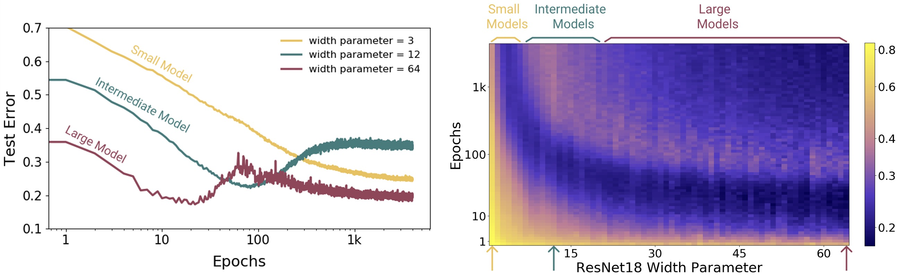

# 第2章：可学性

*Edit: 赵志民，王茂霖，李一飞，Hao ZHAN*

------
## 2.0 本章前言

本章的内容围绕学习理论中的可学性理论展开，主要讨论「事件否能够通过机器学习来解决」这一问题。通过学习理论事先辨别某个问题是否能够被学习，将节省大量的时间与资源。

什么是可行性？
在书中的概念说：对于一个任务，通常我们先要考虑它“是不是可学的（learnable）”.
我们来进一步深入讨论，首先，我们来重新思考一下这个名称“可学性”，我们在设计一个算法之前，我们是不是会首先想这样一些问题，比如说，这个问题是不是能被解决的（从模型的角度说就这个问题是不是可学习的），以及哪些内容是容易学习的（比如两个凸集是好分的），哪些内容是难学习的（比如两个非凸集之间可能是难分的），如果在可学习的情况下，只是需要多少的样本才能保证模型的误差在一定范围内（样本量的问题），有没有一般话的通用的学习模型？

在本章中，我们将通过介绍 "概率近似正确的"（PAC）学习框架，开始正式讨论这些问题。PAC 框架有助于根据实现近似解所需的样本点数量、样本复杂度以及学习算法的时间/空间复杂度（取决于概念的计算表示成本）来定义可学习的概念。

我们首先会描述 PAC 框架并对其进行了说明，然后针对所用假设集包含要学习的概念的一致情况和相反的不一致情况，介绍了当所用假设集有限时该框架内的一些一般学习保证。

---
## 2.1 基本概念

### 2.1.1 基础概念解释

在具体介绍 PAC 模型之前，首先需要明确几个基础定义和符号，这些定义和符号将贯穿本书的大部分内容：

> $X$：表示所有可能的例子或实例的集合。$X$ 有时也被称为输入空间。
> $Y$：表示所有可能的标签或目标值的集合。$Y$ 有时也被称为输出空间。

*说明：在本介绍性章节中，我们将 $Y$ 限制为只有两个标签的情况，即 $Y = \{0, 1\}$（或者 $Y = \{-1, 1\}$，两者仅是符号上的替代）。例如，$Y$ 也可以是 $\{皮卡丘, 海绵宝宝\}$。这是二元分类问题的典型假设。虽然这种简化假设便于理解，但并不会影响后续推论的路径与思路，因为多分类问题只是二分类问题的扩展，虽然从证明和论证上更为复杂。后续章节将扩展这些结果以涵盖更一般的情况。*

*由于 PAC 可学习性等机器学习理论基础建立在统计理论基础之上，本书的绝大部分知识点也都从统计概率的角度展开。*

**从数学角度看待机器学习中的概念：**
从数学角度来说，机器/深度学习可以定义为学习一个映射函数，

> **概念**(concept) $c : X \rightarrow Y$ 是一个从 $X$ 到 $Y$ 的映射。由于 $Y = \{0, 1\}$，我们可以将 $c$ 视为从 $X$ 中得到其取值为 $1$ 的部分，即 $X$ 的子集。

*解释：如果我们能够找到 $X$ 中的子集，其中 $1$ 为目标值，那么通过一个指示函数，我们自然就构造出了 $c$。这种从子集角度和从映射角度的理解是等价的。不过，从子集角度来看，将机器学习理解为集合的划分（或样本空间的划分）更为直观。例如，我们可以将 $X$ 定义为一个有限集合：e.g. $\{-1,0,1,2,3\}$，并让 $c$ 等价于其中的一个子集：e.g. $\{-1,0,3\}$；或将 $X$ 定义为无限集合的子集：e.g. 整个一维实数空间 $\mathbb{R}$ 或一个有限区间，如 $[-10,10]$，让 $c$ 等价于其中的一个子集：e.g. $[-2,-1]\cup[3,4]$。*

因此，接下来我们将学习的概念等同于从 $X$ 到 $\{0, 1\}$ 的映射，或 $X$ 的子集。例如，这个子集可以是三角形内部的点集或这些点的指示函数。在这种情况下，我们简短地称所要学习的概念为一个三角形。概念类是我们希望学习的概念的集合，用 $\mathcal{C}$ 表示。例如，它可以是平面中所有三角形的集合。

*解释：三角形在这里仅是一个概念，类似于 $X$ 的一个子集。从数学角度来说，$c$ 可以被视为从 $X$ 中获取值为 $1$ 的部分子集。二维平面 $\mathbb{R}^2$ 中的一个三角形区域可以被视为其子集，因此三角形也可以被视为一个映射 $c$。*

> **假设空间**（hypothesis space）$\mathcal{H}$ 是指所有可能假设的集合，每个假设 $h \in \mathcal{H}$ 是一个从输入空间 $X$ 到输出空间 $Y$ 的映射函数，形式化定义为：
$$
\mathcal{H} = \{h: X \rightarrow Y\}
$$
其中，$X$ 是输入空间的集合，$Y$ 是输出空间的集合。

假设空间 $\mathcal{H}$ 包含了所有能够将输入映射到输出的函数或模型。换句话说，假设空间包含了所有可能的函数或映射，它们能够根据输入数据产生输出结果，如分类、回归或其他预测任务。假设空间的概念对于理解学习算法的能力和限制至关重要。

假设空间的大小和复杂性决定了算法能够学习到的解决方案的类型。如果假设空间太小或太简单，它可能无法捕捉到数据中的复杂模式，导致欠拟合（Underfitting）。相反，如果假设空间过大或太复杂，它可能包含过于复杂的模型，这些模型可能会过度拟合（Overfitting）训练数据，从而在新的、未见过的数据上表现不佳，这里用到了我们常说的 **「偏倚方差理论」**。

例如，在一个简单的线性分类器中，假设空间可能包括所有可能的线性边界，每个线性边界都是一个假设。在更复杂的模型中，如神经网络，假设空间可能包括所有可能的网络结构和权重配置，这些构成了网络的能力来学习数据的非线性和复杂模式。
选择合适的假设空间是机器学习中的关键步骤，因为它直接影响到学习算法的性能和泛化能力。通常，假设空间的选择需要根据问题的性质、数据的特点以及所需的性能来决定。

需要注意的是，这种理解适用于传统的机器学习，但在深度学习领域，现象更加复杂。
例如，最新研究中观察到的双下降现象（参考文献：[Deep Double Descent: Where Bigger Models and More Data Hurt](https://arxiv.org/abs/1912.02292)） 表明，对于深层神经网络的双下降机制，我们仍然需要深入理解，这是一个开放性问题。

### 2.1.2 基础假设

在此，我们首先假设【实例/样本】是独立且同分布的（i.i.d.），且其符合某种固定但未知的分布$\mathcal{D}$。

学习者会考虑一组固定的可能概念类 $\mathcal{H}$（称为假设集），这组概念不一定与目标的概念类 $\mathcal{C}$ 一致。学习者会收到根据从$\mathcal{D}$中独立同分布抽取的样本集 $X = (x_1, . . , x_m)$ 以及标签集 $Y=(c(x_1), . . , c(x_m)）$，这些标签基于要学习的特定目标概念 $c \in \mathcal{C}$。

### 2.1.3 基本定义

通过以上的讨论，我们来看看现阶段有哪些工具基础：现在我们有了样本的分布定义$\mathcal{D}$（尽管样本分布可能是未知的），但我们还有样本集$D$（可以通过采样观测得到），同时也可以获得对应的样本标签$Y$（尽管映射关系$c$未知）。有了特定的目标概念$c$（期望学习的内容），也有了可能的概念类$\mathcal{H}$（模型能学习到的所有可能性，比如二维平面的线性函数类）。然而，我们发现定义可学习还缺少一个工具，即用于衡量学习到的概念$h$与目标概念$c$之间差异的度量方式。

用于度量两个映射之间的距离有多种方式，但这里我们不作广泛探讨，而是从统计学的角度出发，定义对应的误差度量，我们称之为泛化误差。

假设 $h \in \mathcal{H}$ 的泛化误差（也称为 $h$ 的风险或真实误差），用 $R(h)$ 表示：

> **Definition 2.1 (泛化误差：Generalization error)** 
> 给定一个假设 $h \in \mathcal{H}$、一个目标概念 $c \in \mathcal{C}$ 以及一个基础分布 $\mathcal{D}$，$h$ 的泛化误差或风险定义为
$$
R(h)=\underset{x\sim\mathcal{D}}{\operatorname*{\mathbb{P}}}\left[h(x)\neq c(x)\right]=\underset{x\sim\mathcal{D}}{\operatorname*{\mathbb{E}}}\left[1_{h(x)\neq c(x)}\right], \tag{2.1}
$$
其中，$1_{\omega}$ 是事件 $\omega$ 的指示函数。

*注释：
在这里，我们引入了一个新名词：**事件（Event）**。**事件**是概率和统计中常见的概念。事件指的是在某个【实例/样本】空间（Sample Space）中可能发生的一个或一组结果的集合（或是出现了某种结果性质的情况）。样本空间是所有可能结果的集合，而事件则是对这个空间的子集。事件可以是单个结果，也可以是多个结果的组合，满足某些特定条件或性质。
例如，当我们抛掷一枚硬币时，样本空间是所有可能结果的集合，即 {正面, 反面}。如果我们定义一个事件为 "正面出现"，那么这个事件就是样本空间的一个子集，包含了结果 "正面"。
因此，在概率论中，事件的概念用于定义和计算概率。给定一个事件，我们可以计算其发生的概率。事件的概率是指该事件发生的可能性，通常用0到1之间的数值表示。
在机器学习中，事件的概念更为广泛，也被用来描述数据集中的特定模式或类别。例如，在分类任务中，每个类别可以被视为一个事件，算法的目标是学习如何根据输入数据正确地识别这些事件（即类别）。
在这里，**事件 $\omega$** 代表 $h(x)\neq c(x)$，即“假设概念$h$和目标概念$c$不等价”这一事件。因此，我们进一步定义了事件的概率（即事件发生的可能性），并将这种可能性定义为泛化误差。*

由于泛化误差无法直接求得（其原因在于$\mathcal{D}$的未知性），我们需要利用能够获取的信息来近似泛化误差，因此定义了经验误差：

> **Definition 2.2 (Empirical error)** 
> 给定假设 $h \in \mathcal{H}$、目标概念 $c \in \mathcal{C}$ 和样本集 $S = \{x_1, ... , x_m\}$，$h$ 的经验误差或经验风险定义为
$$
\widehat{R}_S(h)=\frac{1}{m}\sum_{i=1}^{m}1_{h(x_i)\neq c(x_i)}.\tag{2.2}
$$

你可能会注意到，在《机器学习理论导引》、《FOML》以及《UML》中，泛化误差的定义形式不尽相同。

> 例如，在《机器学习理论导引》中，泛化误差定义如下：
> 给定样本集 $D={(x_1,y_1),(x_2,y_2),...(x_m,y_m)}$，$x_i \in \mathcal{X}$，$y_i \in \mathcal{Y}=\{-1,+1\}$，而$\mathcal{D}$是 $\mathcal{X}\times\mathcal{Y}$的联合分布，$D \sim \mathcal{D^m}$，且为独立同分布的。
> 令 $h \in \mathcal{H}$ 为 $\mathcal{X}$ 到 $\mathcal{Y}$ 的映射，其泛化误差为
$$
E(h;\mathcal{D})={P}_{(x,y)\sim\mathcal{D}}\left(h(x)\neq y\right)= \mathbb{E}_{(x,y)\sim\mathcal{D}} \left[\mathbb{I}({h(x)\neq c(x)})\right], \tag{2.3}
$$

要明白，公式 $(2.1)$ 和公式 $(2.3)$ 定义的泛化误差本质上是一致的，只是数学描述的方式不同。公式 $(2.3)$ 是按照$\mathcal{D} \subset \mathcal{X}\times\mathcal{Y}$ 的联合分布定义的，而公式 $(2.1)$ 是按照$\mathcal{D} \subset \mathcal{X}$ 的分布以及目标概念$c\in\mathcal{C}$定义的。

在目标概念$c$确定的情况下，$ c(x) = y \in \mathcal{Y}$，$\forall x \in \mathcal{X}$，因此两者是等价的，经验误差公式同理。

书中 **P25** 提到了当样本从样本空间独立同分布采样得到时，经验误差的期望等于其泛化误差。在此，我们对该证明进行补充。

#### 1)【证明补充】经验误差的期望等于其泛化误差

首先补充说明「经验误差」和「泛化误差」的概念：

- **泛化误差**：泛化误差是一个理想化的误差概念。计算泛化误差需要知道样本的真实分布，而在大多数情况下，数据样本的真实分布情况并不为人所知。由于人们所获得的信息大多由**采样（sampling）**后的样本提供，因此在缺乏真实分布信息的情况下，无法求得**泛化误差**。正因为泛化误差不可直接计算，研究者们不得不寻找一种替代方法来定义学习算法的误差。这一替代方法即为**经验误差**。
- **经验误差**：经验误差是指学习算法在样本上的误差。当数据与映射关系确定时，便能够求得具体的经验误差。

通过大数定理，可以进一步讨论经验误差与泛化误差的关系。当样本量足够大时，数据的采样分布接近真实分布，经验误差的极限也会趋于泛化误差。另一方面，若将每一个采样的样本都视为随机变量，那么经验误差的期望也就等于泛化误差：

$$
\mathrm{E}[\widehat{R}(h ; D)]=R(h ; \mathcal{D})
$$

证明过程分为两步，首先考察等式右边，泛化误差可表示为： 

$$
R(h ; \mathcal{D})=P_{(x, y) \sim \mathcal{D}}(h(x) \neq y)=\mathbb{E}_{(x, y) \sim \mathcal{D}}[\mathbb{I}(h(x) \neq y)]
$$

然后考察等式左边，经验误差可表示为： 

$$
\widehat{R}(h ; D)=\frac{1}{m} \sum_{i=1}^{m} \mathbb{I}\left(h\left(\boldsymbol{x}_{i}\right) \neq y_{i}\right)
$$

经验误差的期望为： 

$$
\mathrm{E}[\widehat{R}(h ; D)]=\underset{D \sim D^{m}}{\mathrm{E}}[\widehat{R}(h)]=\frac{1}{m} \sum_{i=1}^{m} \underset{(x,y) \sim D}{\mathrm{E}}[\mathbb{I}\left(h\left(\boldsymbol{x}_{i}\right) \neq y_{i}\right)]
$$
 
由于样本服从独立同分布，所有样本的期望值相同，期望的平均值就等于样本的期望，因此：

$$
\mathrm{E}[\widehat{R}(h ; D)]=R(h ; \mathcal{D})
$$

证毕。

#### 2)【概念补充】假设空间的可分性与不可分性

书中 **P26** 提到了可分性的问题，在此对该概念进行进一步说明。

- **假设空间**：可分性是一个针对假设空间的概念，因此需要先明确什么是假设空间。简单来说，假设空间是对学习算法最大能力的整体刻画。假设空间表述了给定算法所有可能的映射函数，而待学习的概念是样本空间到标记空间的映射（即一个函数映射）。如果目标概念存在于假设空间中，那么对于给定的学习算法，其具备某个映射函数能够正确地区分所有的样本类别。

- **可分性**：可分性（separable）和不可分性（non-separable）是针对假设空间的一种性质定义，即考察对于给定学习算法，是否存在能够完全区分所有样本的映射。如果存在，则该学习算法对于此假设空间可分；如果不存在，则不可分。

  关键在于 **「潜在」** 一词，表示一种存在性的考察。假设空间中的映射并不唯一，甚至可能是无穷的。例如，在二分类的感知机案例中，对于 $y=sign(wx+b)$ 而言，任意 $w,b$ 都可以构成一个映射。这些 **「潜在」** 映射就构成了感知机学习算法的假设空间。当人们说该学习算法对于假设空间可分时，意味着对于所有线性可分的样本来说，感知机的假设空间是可区分的。即存在某个 $y=wx+b$ 能够将样本区分开来。

- **严格性与能力上限**：可分性具有一定局限性，主要体现在严格性和能力上限两个方面。

  可分性的严格性指的是其要求所有样本都可分。有时，由于噪声或异常值的影响，数据并非完全可区分，算法只能区分绝大多数样本。因此，可分性并未完全定义学习算法的有效性。

  此外，可分性仅表示了学习算法的能力上限。例如，当我们在线性模型中使用高斯核技巧时，能够对任意二分类样本进行区分（维度为无穷）。但从如此庞大的假设空间中找到正确映射函数却非常困难，这在深度学习中尤为明显。在这个意义上，可分性仅表示了学习算法的能力上限。

#### 3)【概念补充】关于 $size(c)$

**P27** 中的 **定义2.2**，**定义2.3** 和 **定义2.4** 通过多项式函数 $poly(1/\epsilon,1/\delta,size(x),size(c))$ 定义了 PAC 可学、PAC 学习算法和样本复杂度等概念。但是对于 $size(c)$ 并没有过多描述，故在此对其进行补充说明。

- **概念的表示**：当谈论一个概念或概念类时，通常使用一些固有的**「表示方案」**来描述该概念。所谓「表示方案」，即可以通过函数 $\mathcal{R} : \Sigma^* \rightarrow \mathcal{C}$ 来实现对概念的表征的方法，其中 $\Sigma$ 是有限符号表（例如 {0, 1}），$\Sigma^*$ 是符号组成的合法字符串集合。对于 $\Sigma^*$ 中的任意一个字符串 $\sigma$，通过映射 $\mathcal{R}(\sigma) = c$ 产生了概念 $c$ 在 $\mathcal{R}$ 下的一个表示。当然，某个概念在 $\mathcal{R}$ 下可能有多种表示。

- **表示的复杂度**：既然概念可以有不同的表示，那么自然也产生了对表示复杂度的讨论。假设与 $\mathcal{R}$ 相关联的映射  $size:\Sigma^* \rightarrow \mathcal{C}$ 可以为每个表示形式分配一个自然数 $size(h)$，其中，$size(\cdot)$ 是任何符合自然定义的映射关系。例如在 $\Sigma = {0，1}$ 的情况下，我们将 $size(h)$ 定义为 $h$ 的二进制长度。当二进制表示不方便时，可以采用其他表示方式——但无论如何，新定义的方式始终能够被一个关于二进制长度的多项式所描述。例如，我们可以将决策树的大小定义为树中的节点数，无论我们使用什么样的方法对该决策树进行编码，$size(h)$始终可以用一个关于二进制字符串的长度的多项式来描述。

- **概念的复杂度**：概念的表示越复杂，越有利于表征概念本身；表示越简单，越不利于表征概念本身。由于在评判目标概念的复杂度时，需要考虑到最差的情况，因此我们往往集中关注最简单的概念表示（即最不利于了解概念）。因此，定义概念的复杂度 $size(c)$ 为所有表示方案中最简单表示对应的复杂度，即：
$$
size(c) = \min_{\mathcal{R}(\sigma)=c}{size(\sigma)}
$$

#### 4)【概念补充】时间复杂度

**P27** 介绍了时间复杂度和样本复杂度的概念，在此对二者的等价性进行补充。

由于不同的机器、操作系统会带来完全不同的运行时间，因此在考察时间复杂度时通常会使用抽象机。抽象机通常是抽象意义上的图灵机或实体意义上的图灵机。在该抽象机中，时间复杂度被定义为「需要执行的“操作”数量」。

一般而言，学习问题是否可以有效解决，取决于如何将其分解为一系列特定的学习问题。考虑学习有限假设类的问题，例如训练样本的数量为 $m_H(\epsilon，δ)= \log(|\mathcal{H}|/δ)/\epsilon^2$ 的情况。如果对一个 $h$ 的评估花费固定的时间，那么可以通过对 $\mathcal{H}$ 进行详尽搜索，在时间 $O(|H|m_H(\epsilon，δ))$ 内完成这项任务。对于任何固定的有限假设类 $\mathcal{H}$，穷举搜索算法都可以在多项式时间内运行。如果问题序列 $|H_n| = n$，那么穷举搜索被认为是高效的；如果 $|H_n| = 2^n$，则样本复杂度为 $n$ 的多项式，而穷举搜索算法的计算复杂度随 $n$ 呈指数增长。此时，穷举搜索被认为是低效的。

#### 时间复杂度的严谨描述

可以分两个步骤定义学习的复杂性。考虑固定学习问题的计算复杂性（由三元组 $(Z, H, \mathcal{l})$ ——学习数据集 (domain set)，基准假设类 (benchmark hypothesis class) 和损失函数 确定）。然后，在第二步中，我们考虑一系列此类任务的复杂度变化情况。

1. 给定一个函数 $f：(0,1)^2→\mathbb{N}$ ，一个任务 $(Z, H, \mathcal{l})$ 和一个学习 算法 $\mathcal{A}$ ，我们说 $\mathcal{A}$ 能在 $O(f)$ 时间内解决学习任务，如果存在某个常数 $c$ ，对于每个 $Z$ 上的概率分布 $D$ ，算法 $\mathcal{A}$ 基于从分布 $D$ 中独立同分布采样得到的样本，给定的  $\epsilon, \delta \in (0,1)$ ，能够满足以下条件：
- $\mathcal{A}$ 最多执行 $cf(\epsilon, \delta)$ 个运算后终止。
- 表示为 $h_A$ 的 $\mathcal{A}$ 的输出在最多使用 $cf(\epsilon, \delta)$ 个示例之后即可用于预测新标签。
- $\mathcal{A}$ 的输出是 PAC (probably approximately correct) 的，即不超过 $\delta$ 的错误率使结果误差不超过 $\epsilon$。

2. 考虑一系列学习问题， $(Z_n, H_n, \mathcal{l_n})_{n=1}^∞$ ，其中问题 $n$ 由学习数据集 $Z_n$ ，假设类 $H_n$ 和损失函数 $\mathcal{l}_n$ 定义。设 $\mathcal{A}$ 为设计用于解决学习问题的学习算法这种形式。给定一个函数 $g: \mathbb{N} × (0,1)^2 \rightarrow  \mathbb{N}$, 则 $\mathcal{A}$ 的耗时是 $O(g)$。如果对于所有 $n$ ，$\mathcal{A}$ 求解问题 $(Z_n, H_n, \mathcal{l_n})_{n=1}^∞$ 用时 $O(f_n)$ ，其中 $f_n：(0,1)^2\rightarrow\mathbb{N}$ 定义为 $f_n(\sigma，δ)＝ g(n，\sigma，δ)$。

#### 5)【概念补充】样本复杂度

**P27** 提到了样本复杂度（Sample Complexity）的概念，在此进行补充说明。

- **样本复杂度定义**：**样本复杂度**由这样一个二元函数决定： $\mathcal{m}_{\mathcal{H}}:(0,;1)^2\rightarrow\mathbb{N}$ ，其中，二元函数  $\mathcal{m}$ 的两个自变量分别是要求的精度 (accuracy) $\epsilon$ 和要求的置信度 (confidence)  $\delta$ 。同样， $\mathcal{m}$ 也与假设空间$\mathcal{H}$ 有关系。

每个有限假设类都是PAC可学习且拥有样本复杂度： 
$$
\mathcal{m}_{\mathcal{H}}(\epsilon,\delta)\leq[\frac{\log(|H|/\delta)}{\epsilon}]
$$

- **样本复杂度与数据复杂度 $size(c)$ 的区分**：注意，样本复杂度与之前的数据复杂度 $size(c)$ 不同，后者指的是数据本身的复杂程度，而样本复杂度是关于假设空间 $\mathcal{H}$ 所需样本数量的描述，也即对一个算法来说，我们需要多少样本才能获得一个 PAC 学习的解（probably approximately correct solution)。

#### 6)【概念补充】PAC-Bayes理论

PAC学习理论主要研究如何在有限的样本和计算资源下，从给定的假设空间中找到一个近似正确的假设。PAC学习理论为学习算法在多大概率下能够找到一个误差不超过一定范围的假设提供了数学框架。
贝叶斯（Bayes）统计利用先验知识和观察到的数据，通过贝叶斯定理更新概率分布，从而进行推断。贝叶斯方法强调利用先验分布和后验分布来进行推理和决策。

PAC-Bayes理论结合了PAC学习和贝叶斯方法的优点。其核心思想是，通过考虑假设空间中的概率分布来描述学习算法的行为，并给出关于学习算法在有限数据情况下泛化误差的界限。具体来说，PAC-Bayes理论关注以下问题：
1. 先验分布和后验分布：在假设空间中定义一个先验分布，通过观测数据更新得到后验分布。
2. 泛化误差的界限：基于后验分布，给出学习算法的泛化误差上界。这些上界通常以概率的形式给出，确保在高概率下，算法的泛化误差不会超过某个界限。
PAC-Bayes界限的形式一般涉及到假设的复杂度（通过KL散度度量）和训练误差的综合衡量，从而给出一个平衡了模型复杂度和数据拟合程度的泛化误差上界。

PAC-Bayes不等式是PAC-Bayes理论的核心结果之一，它为后验分布下的泛化误差提供了一个上界。典型的PAC-Bayes不等式形式如下（参考文献：[PAC-Bayesian Stochastic Model Selection](https://link.springer.com/article/10.1023/A:1021840411064)）：
$$
\mathbb{E}_{Q}[L(h)] \leq \mathbb{E}_{Q}[\hat{L}(h)] + \sqrt{\frac{KL(Q \| P) + \ln\frac{1}{\delta} + \ln m + \ln 2}{2m-1}}
$$

其中：
- $L(h)$ 是假设 $h$ 的真实误差（泛化误差）。
- $\hat{L}(h)$ 是假设 $h$ 在训练集上的经验误差。
- $Q$ 是假设的后验分布。
- $P$ 是假设的先验分布。
- $KL(Q \| P)$ 是后验分布 $Q$ 和先验分布 $P$ 之间的 KL 散度。
- $\delta$ 是置信参数，表示上界成立的概率。
- $m$ 是样本数量。

## 2.3 分析实例

#### 7) 【概念补充】析取和合取

**析取范式（Disjunctive Normal Form, DNF）** 是一种布尔逻辑公式的表示形式。在析取范式中，公式由若干个子句的“或”（$\vee$）运算组成，每个子句是若干个文字（变量或其否定形式）的“与”（$\wedge$）运算。换句话说，析取范式是一些合取项的析取。

- **文字（Literal）**: 布尔变量或其否定形式（如 $x_i$ 或 $\neg x_i$）。
- **合取项（Conjunction/Term）**: 由多个文字的“与”运算组成的表达式，如 $x_1 \wedge \neg x_2 \wedge x_3$。
- **析取项（Disjunction）**: 由多个合取项的“或”运算组成的表达式，如 $(x_1 \wedge \neg x_2) \vee (x_3 \wedge x_4)$。

在析取范式中，一个布尔公式可以表示为如下形式：
$$
T_1 \vee T_2 \vee \dots \vee T_m
$$
其中，每个 $T_i$ 是一个合取项。

**合取范式（Conjunctive Normal Form, CNF）** 是另一种布尔逻辑公式的表示形式。在合取范式中，公式由若干个子句的“与”（$\wedge$）运算组成，每个子句是若干个文字的“或”（$\vee$）运算。也就是说，合取范式是一些析取项的合取。

在合取范式中，一个布尔公式可以表示为如下形式：
$$
C_1 \wedge C_2 \wedge \dots \wedge C_n
$$
其中，每个 $C_i$ 是一个析取项。

#### 8)【证明补充】布尔合取式

**P30** 中提到了布尔合取式的PAC可学问题，在此对该证明进行补充。

由于 $h$ 的文字总是包含 $c$ 的文字，$h$ 总是至少与 $c$ 一样具体。这意味着：$h$ 包括 $c$ 的所有约束，可能还有更多。
因此，$h$ 在目标概念 $c$ 的负例上永远不会出错。

事实上，要使 $h$ 在负例 $a$ 上出错，必须 $h(a) = 1$（即，$h$ 错误地将 $a$ 分类为正例）。然而，由于 $h$ 包含 $c$ 的所有文字，$h(a) = 1$ 意味着 $c(a) = 1$。
因此，如果 $a$ 是一个负例（即 $c(a) = 0$），则 $h$ 也会评估为 $0$，因为 $h$ 不能在不违反 $c$ 中某个文字的情况下被 $a$ 满足。

在 PAC 可学问题中，我们需要考虑 $size(x)$ 和 $size(c)$。
$size(x)$ 是数据 $x$ 的复杂度，即数据的长度，即布尔向量 $x$ 中变量的个数。对于一个有 $n$ 个变量的布尔向量，复杂度 $size(x)$ 为 $n$。
$size(c)$ 是目标概念 $c$ 的复杂度，$size(c)$ 是合取式中布尔文字（布尔变量及其否定）的个数。
例如，考虑目标概念 $c=(x_1 \land \bar{x_2} \land x_3 \land \bar{x_4})$。这个表达式由4个布尔文字组成，因此其复杂度 $size(c)$ 为 4。

#### 9)【证明补充】3项析取范式不可有效PAC学习性

书中 **P32** 提到了3项析取范式的不可有效PAC学习性，我们在此对该证明进行补充。
我们想要证明3项析取范式(3-term Disjunctive Normal Form, DNF)的类在概率近似正确学习(PAC learning)下是难以学习的，除非 $RP = NP$。

1. 3项DNF的定义

- **3项DNF公式**: 由三个子句（项）组成，每个子句是布尔变量的合取（AND）。整个公式是这三个子句的析取（OR）。
- **公式的大小**: 由所有子句中的文字（变量或其否定）数量之和决定。对于$n$个布尔变量，这个大小最多为$6n$。

2. $RP \neq NP$

在计算复杂性理论中，$RP$ 类包含那些可以通过随机算法在多项式时间内解决的问题（Randomized Polynomial Time），其中算法在给定一个“是”的实例时有很高的概率（至少 $1/2$）返回“是”，而在给定一个“否”的实例时总是返回“否”。
$NP$ 类包含那些在多项式时间内可以被验证而不一定是被解决的问题（Nondeterministic Polynomial Time）。也就是说，如果问题的解是“是”，那么存在一个多项式时间的验证过程，能够验证这个解的正确性。
$RP \neq NP$这个表达的意思是假设 $RP$ 类和 $NP$ 类是不相同的。即，存在一些问题在 $NP$ 中，但不在 $RP$ 中。这意味着，对于这些问题，我们不能设计出一个随机化算法在多项式时间内以较高概率正确解决问题。

3. 证明策略

我们通过将一个NP完全问题（在这里选择图的3-着色问题）化简为学习3项DNF公式的问题来进行证明。
关键是构造一个样本集$S_G$，使得如果图$G$是3-可着色的，那么存在一个3项DNF公式与$S_G$一致；反之，如果$G$不可3-着色，那么不存在这样的公式与$S_G$一致。

#### 3. 图的3-着色问题

- **图的3-着色**: 给定一个无向图$G=(V,E)$，判断是否可以用三种颜色对顶点进行着色，使得任意一条边的两个端点颜色不同。

#### 4. 构造样本集 $S_G$

- **正例 $S_G^+$**: 对于每个顶点$i$，构造向量$v(i)$，该向量在第$i$位为0，其他位为1，并标记为正例$(v(i), 1)$。
- **反例 $S_G^-$**: 对于每条边$(i, j)$，构造向量$e(i,j)$，该向量在第$i$和第$j$位为0，其他位为1，并标记为反例$(e(i,j), 0)$。

#### 5. 一致性和3-可着色性的等价性

- **一致性**: 如果一个3项DNF公式对样本集$S_G$中的所有样本都给出正确的分类结果，我们说这个公式与$S_G$一致。
- **等价性**: 图$G$是3-可着色的，当且仅当存在一个3项DNF公式与$S_G$一致。

#### 6. 3项DNF公式的构造

现在，我们详细说明如何根据图$G$的3-可着色性构造3项DNF公式，并解释为什么这种构造与样本集$S_G$一致。

- **颜色划分与子句构造**：
  - 假设图$G$是3-可着色的，意味着我们可以将所有顶点分成三组，分别着红、蓝、黄三种颜色。
  - 对于每种颜色，我们构造一个合取项。例如，假设$T_R$表示红色顶点的集合，那么$T_R$由所有不着红色的顶点的变量的否定组成。
  - 例如，如果顶点$j$和$k$不着红色，则$T_R = \neg x_j \wedge \neg x_k$。这里的$\neg x_j$表示顶点$j$没有被着红色。

- **正例与一致性**：
  - 对于每个正例$v(i)$，我们需要这个向量能满足某个子句$T_c$，即$v(i)$输入到$T_c$中时，$T_c$应该为真。
  - 假设顶点$i$被着成红色，那么$v(i)$中在第$i$位是0，其他位置是1。此时，$v(i)$会使$T_R$为真，因为$T_R$的合取项中的所有文字都与$v(i)$一致——即$v(i)$中对应于非红色顶点的位置都是1，这些位置的$\neg x_j$为真。

- **反例与一致性**：
  - 对于每条边$(i, j)$的反例$e(i,j)$，我们需要这个向量不能满足整个DNF公式$T_R \vee T_B \vee T_Y$，即$e(i,j)$输入到该公式中时，公式应为假。
  - 假设顶点$i$着红色，顶点$j$着蓝色。则$T_R$由不着红色的顶点变量的否定组成，$T_B$则由不着蓝色的顶点变量的否定组成。
  - 因为$e(i,j)$在第$i$和$j$位都是0，$T_R$的合取项需要这些位是1才能为真，因此$e(i,j)$不能满足$T_R$。同理，由于$j$着蓝色，$e(i,j)$也不能满足$T_B$，同样它也不能满足$T_Y$。

因此，对于每个反例$e(i,j)$，公式$T_R \vee T_B \vee T_Y$都不会为真，这就保证了公式与样本集$S_G$一致。

#### 7. 结论

因此，如果我们可以有效地学习3项DNF公式，那么就可以用它来解决 $NP$ 完全问题（如图的3-着色），这意味着$RP = NP$。
由于普遍认为$RP \neq NP$，所以3项DNF类在PAC学习下是不可有效学习的。

#### 10)【案例补充】可知学习

**P31** 提到了可知学习与不可知学习，这里用一个案例来进行说明。

在布尔函数中，关于 $d$ 个输入变量有 $2^d$ 种可能。也就是说，当输入的样本量为 $d$ 时，最多有 $2^d$ 种情况。例如，当有2个输入时，一共有4种可能的情况出现，这4种情况对应于16种二元函数假设，如下表所示。

| x1   | x2   | h1   | h2   | h3   | h4   | h5   | h6   | h7   | h8   | h9   | h10  | h11  | h12  | h13  | h14  | h15  | h16  |
| ---- | ---- | ---- | ---- | ---- | ---- | ---- | ---- | ---- | ---- | ---- | ---- | ---- | ---- | ---- | ---- | ---- | ---- |
| 0    | 0    | 0    | 0    | 0    | 0    | 0    | 0    | 0    | 0    | 1    | 1    | 1    | 1    | 1    | 1    | 1    | 1    |
| 0    | 1    | 0    | 0    | 0    | 0    | 1    | 1    | 1    | 1    | 0    | 0    | 0    | 0    | 1    | 1    | 1    | 1    |
| 1    | 0    | 0    | 0    | 1    | 1    | 0    | 0    | 1    | 1    | 0    | 0    | 1    | 1    | 0    | 0    | 1    | 1    |
| 1    | 1    | 0    | 1    | 0    | 1    | 0    | 1    | 0    | 1    | 0    | 1    | 0    | 1    | 0    | 1    | 0    | 1    |

每个不同的训练实例都会去掉一半的假设。例如，假设我们有 $x_1 = 0 , x_2 = 1$ ，输出为 0；这就删除了  $h5、h6、h7、h8、h13、h14、h15、h16$。这就是学习的一种方式。在布尔函数的情况下，为了得到一个单一的假说，我们需要看到所有的二维训练实例。如果我们得到的训练集只包含所有可能的实例中的一小部分子集——也就是说，如果我们只知道只有一小部分实例的输出应该是什么，那么解就不是唯一的。在看到N个例子之后，还有 $2^{2^d-N}$ 个可能的函数。

例如，如果你有 𝑛 个布尔变量 $x_1, x_2, … , x_n$，那么一个数据 $x$ 可以是这些变量的一个具体取值，例如 $(1,0,1,…,0)$。

## 参考文献

[1] Understanding Machine Learning：3.1，8.1

[2] Foundations of Machine Learning：2

[3] An Introduction to Computational Learning Theory：1.2