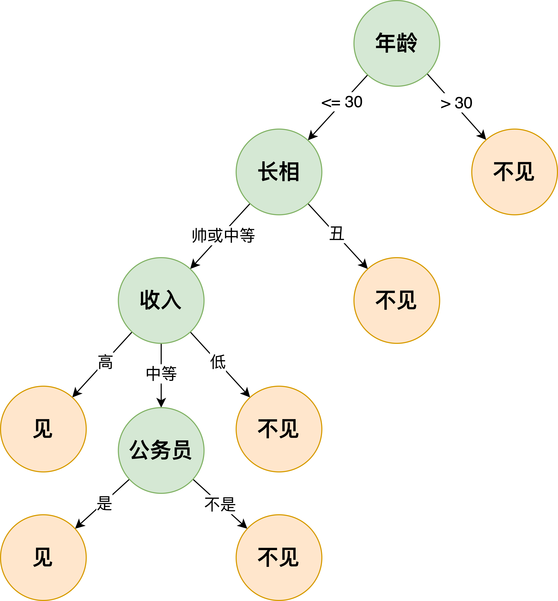

# 第6章：一致性

*编辑：赵志民，王茂霖，Hao ZHAN*

------

## 本章前言

本章内容主要探讨学习理论中的一致性（consistency），研究随着训练数据的增加，通过学习算法所获得的分类器是否逐渐逼近贝叶斯最优分类器。具体内容包括一致性的定义、参数方法下的一致性分析、非参数方法下的一致性分析，以及随机森林一致性分析的案例。

### 6.1 【公式证明】泛化风险的无偏估计

**P117**中，公式（6.25）给出了分类器的经验风险 $\hat R$，并指出其为泛化风险 $R$ 的无偏估计。以下对这一概念进行详细说明。

首先，需要理解经验风险 $\hat R$ 和泛化风险 $R$ 的概念。经验风险是基于模型的预测结果与真实结果的比较计算出的量化风险指标。泛化风险则是基于数据-标签联合分布的样本（视为随机变量）的预测结果与真实值的比较的期望值。由于实际情况下数据-标签联合分布通常未知，泛化风险 $R$ 更多是一个理论化的概念。

其次，当我们说 $y$ 是 $x$ 的无偏估计时，意味着 $\mathbb{E}[x]=y$。根据这一概念，我们可以证明经验风险是泛化风险的无偏估计。

泛化风险定义为：
$$
\begin{align}
R(f) &=\mathbb{E}_{(x, y) \sim \mathcal{D}}[\mathbb{I}(y f(x) \leqslant 0)] \\
&=\mathbb{E}_{x \sim \mathcal{D}_{\mathcal{X}}}[\eta(x) \mathbb{I}(f(x) \leqslant 0)+(1-\eta(x)) \mathbb{I}(f(x) \geqslant 0)]
\end{align}
$$

经验风险定义为：
$$
\begin{equation}
\hat R(f)  = \frac{1}{m} \sum_{i=1}^{m} \mathbb{I}\left(y_{i} f\left(x_{i}\right) \leqslant 0\right)
\end{equation}
$$

现在我们证明经验风险是泛化风险的无偏估计：

假设所有样本都是从一个未知的样本-标签空间 $D$ 中独立同分布采样的，对经验风险求期望：
$$
\begin{align}
\mathbb{E}({\hat R(f)}) &=\mathbb{E}_{(\boldsymbol{x_i}, y_i) \sim \mathcal{D}}[{ \frac{1}{m} \sum_{i=1}^{m} \mathbb{I}\left(y_{i} f\left(x_{i}\right) \leqslant 0\right)}] \\
&= \frac{1}{m} \sum_{i=1}^{m} \mathbb{E}_{(\boldsymbol{x_i}, y_i) \sim \mathcal{D}}[{ \mathbb{I}\left(y_{i} f\left(x_{i}\right) \leqslant 0\right)}]\\
&= \frac{1}{m} \sum_{i=1}^{m} \mathbb{E}_{(x, y) \sim \mathcal{D}}[{ \mathbb{I}\left(y f\left(x\right) \leqslant 0\right)}]\\
&= \frac{1}{m} \sum_{i=1}^{m} R(f)\\
&= R(f)
\end{align} 
$$

### 6.2 【定理补充】替代函数一致性

**P120**的定理6.1给出了替代一致性的充分条件。首先，我们推导了函数的泛化风险与贝叶斯风险之间的差值不等式。根据一致性的定义，我们需要证明，当 ${R_{\phi}\left(\hat{f}_{m}\right) \rightarrow R_{\phi}^{*}}$ 时，$R\left(\hat{f}_{m}\right) \rightarrow R^{*}$。

为了实现这一目标，我们进一步构造了关于 ${R_{\phi}\left(\hat{f}_{m}\right) - R_{\phi}^{*}}$ 的不等式。利用两个不等式之间的关联性，最终得到 $R\left(\hat{f}_{m}\right)-R^{*} \leqslant 2 c \sqrt[s]{R_{\phi}\left(\hat{f}_{m}\right)-R_{\phi}^{*}}$，从而证明当 ${R_{\phi}\left(\hat{f}_{m}\right) \rightarrow R_{\phi}^{*}}$ 时，$R\left(\hat{f}_{m}\right) \rightarrow R^{*}$。其中，不等式（6.40）的推导包含了一定的构造技巧，之后利用定理中的条件得出了不等式（6.43）。通过构造的凸函数性质，最终证明了这一结论。

### 6.3 【概念补充】划分机制方法

**P122**介绍了一种将样本空间划分成多个互不相容区域的方法，然后对各区域内的正例和反例分别计数，并以多数类别作为区域中样本的标记。这种方法本质上不同于参数方法，它并不是在参数空间中进行搜索构建划分超平面，而是在泛函空间上直接进行搜索。

一个典型的例子是我们熟悉的决策树模型：

每当构造一个决策树的节点时，相当于在样本空间上进行了一次划分（即划分机制）。这种洞察方式同样适用于解释剪枝操作，即通过减少不必要的节点来简化树结构，同时保持或提高模型的性能。

### 6.4 【概念解释】依概率成立

**P124**的定理6.2提到一个定义——依概率成立。这是概率论与数理统计中的一个概念，表达如下：
$$
\begin{equation}
\lim _{n \rightarrow \infty} P((Diam(\Omega)-0) \geq \epsilon)=0
\end{equation}
$$
和对于所有 $N>0$：
$$
\begin{equation}
\lim _{n \rightarrow \infty} P((N(x)>N)=1
\end{equation}
$$
它意味着当 $n$ 趋于无穷时，几乎处处的 $Diam(\Omega)$ 都处于 $0$ 的 $\epsilon$ 邻域内。而 $N(x)$ 的极限几乎处处为无穷大。依概率成立是一种比极限更弱的情况，即可以忽略概率趋于 $0$ 的情形。

### 6.5 【定理补充】划分机制一致性

**P124**的定理6.2给出了划分一致性的充分条件。首先我们定义了 $\Omega(x)$ 作为划分区域的条件概率极大似然估计量：
$$
\begin{equation}
\hat{\eta}(x)=\sum_{x_{i} \in \Omega(x)} \frac{\mathbb{I}\left(y_{i}=+1\right)}{N(x)}
\end{equation}
$$
再根据划分机制构造分类器（输出函数）$h_{m}(x)=2 \mathbb{I}\left(\hat{\eta}(x) \geqslant \frac{1}{2}\right)-1$。为了证明划分机制的一致性，我们需要证明其输出函数的泛化风险在 $m$ 趋于无穷时，趋于贝叶斯风险。

在此，我们利用了基于条件概率估计的插值法，并借助引理6.2得到了输出函数的泛化风险与贝叶斯风险之间的差值不等式。对于不等式右侧的期望，利用三角不等式进行放缩，可得（6.62）。

根据假设条件：
$$
\begin{equation}
\lim _{m \rightarrow \infty} P((Diam(\Omega)-0) \geq \epsilon) =  \lim _{m \rightarrow \infty} P(( \sup _{x, x^{\prime} \in \Omega}\left\|x-x^{\prime}\right\| -0) \geq \epsilon)=0
\end{equation}
$$

由于 $\eta(x)$ 在样本空间中具有连续性，因此在任意邻域内我们都可以用 $\hat\eta(x)$ 的期望值来近似 $\eta(x)$。当邻域趋于 0 时，可得：
$$
\begin{equation}
\mathbb{E}[|\bar{\eta}(x)-\eta(x)|] \rightarrow 0
\end{equation}
$$
这是由于 ${x}^{\prime}$ 被依概率限制在一个 $\epsilon$ 邻域内，且期望可以忽略概率趋于 0 的点，因此 $\bar{\eta}(x)$ 由于 $\eta(x)$ 的连续性也被限制在一个 $\eta(x)$ 的 $\epsilon$ 邻域内，从而期望的极限得证。

接下来，针对三角不等式右式的前半部分，将其拆分为 $N(x)=0$ 和 $N(x)>0$ 两部分：
$$
\begin{equation}
\begin{array}{c}
\mathbb{E}\left[|\hat{\eta}(x)-\bar{\eta}(x)| \mid x, x_{1}, \ldots, x_{m}\right] = 
\mathbb{E}\left[|\hat{\eta}(x)-\bar{\eta}(x)|\mid N(x)=0 , x, x_{1}, \ldots, x_{m}\right] \\
+\mathbb{E}\left[\left|\sum_{x_{i} \in \Omega(x)} \frac{\mathbb{I}\left(y_{i}=+1\right)-\bar{\eta}(x)}{N(x)}\right| N(x)>0, x, x_{1}, \ldots, x_{m}\right]\\
\leqslant P\left(N(x)=0 \mid x, x_{1}, \ldots, x_{m}\right) + \mathbb{E}\left[\left|\sum_{x_{i} \in \Omega(x)} \frac{\mathbb{I}\left(y_{i}=+1\right)-\bar{\eta}(x)}{N(x)}\right| N(x)>0, x, x_{1}, \ldots, x_{m}\right]
\end{array}
\end{equation}
$$
然后，对于不等式右侧的第二部分，利用引理6.3的不等式，可以得到：
$$
\begin{equation}
\begin{array}{l}
\mathbb{E}\left[\left|\sum_{x_{i} \in \Omega(x)} \frac{\mathbb{I}\left(y_{i}=+1\right)-\bar{\eta}(x)}{N(x)}\right| N(x)>0, x, x_{1}, \ldots, x_{m}\right] \\
\leqslant \mathbb{E}\left[\sqrt{\frac{\bar{\eta}(x)(1-\bar{\eta}(x))}{N(x)}} \mathbb{I}(N(x)>0) \mid x, x_{1}, \ldots, x_{m}\right]
\end{array}
\end{equation}
$$

对于此不等式的右侧，再进行放缩。对于任意 $k \geq 3$，当 $N(x) \leqslant k$ 时，$\sqrt{\frac{\bar{\eta}(x)(1-\bar{\eta}(x))}{N(x)}} \leqslant \frac{1}{2}$，当 $N(x) > k$ 时，$\sqrt{\frac{\bar{\eta}(x)(1-\bar{\eta}(x))}{N(x)}} \leqslant \frac{1}{2\sqrt k}$，从而得到不等式右侧的进一步放缩：
$$
\begin{equation}
\leqslant \frac{1}{2} P\left(N(x) \leqslant k \mid x, x_{1}, \ldots, x_{m}\right)+\frac{1}{2 \sqrt{k}} P\left(N(x) > k \mid x, x_{1}, \ldots, x_{m}\right)\\
\leqslant \frac{1}{2} P\left(N(x) \leqslant k \mid x, x_{1}, \ldots, x_{m}\right)+\frac{1}{2 \sqrt{k}}
\end{equation}
$$

结合前面的结果，我们可以得出：
$$
\begin{equation}
\mathbb{E}[|\hat{\eta}(x)-\bar{\eta}(x)|] \leqslant \frac{1}{2} P(N(x) \leqslant k)+\frac{1}{2 \sqrt{k}}+P(N(x)=0)
\end{equation}
$$

根据 $N(x) \rightarrow  \infty$ 依概率成立，当 $m \rightarrow  \infty$ 时，$P(N(x) \leqslant k) \rightarrow  0$，$P(N(x) = 0) \rightarrow  0$。并且当取 $k=\sqrt{N(x)}$ 时，$\frac{1}{2 \sqrt{k}} \rightarrow  0$ 依概率成立，从而得出结论：
$$
\begin{equation}
\mathbb{E}[|\hat{\eta}(x)-\bar{\eta}(x)|] \rightarrow 0
\end{equation}
$$
最终证明了其输出函数的泛化风险在 $m$ 趋于无穷时，趋于贝叶斯风险：
$$
\begin{equation}
R\left(h_{m}\right)-R^{*} \leqslant 2 \mathbb{E}[|\hat{\eta}(x)-\eta(x)|]  \rightarrow 0
\end{equation}
$$

### 6.6 【定理补充】随机森林的划分一致性

**P130**中的定理6.5提到了一种简化版本的随机森林，即每次划分都是均匀随机的，并不依赖于训练集的标签。以下对证明直径 $Diam(\Omega(x,Z))\rightarrow 0$ 的步骤进行补充说明。

首先，令 $L_j$ 表示区域 $\Omega(x,Z)$ 中第 $j$ 个属性的边长，我们可以得到 $Diam(\Omega(x,Z))$ 与 $L_j$ 的关系：
$$
\begin{align}
Diam(\Omega(x,Z))&=sup_{x,x'\in\Omega}||x-x'||\\
&=\sqrt{\sum_{j=1}^dL_j^2}
\end{align}
$$

对于 $Diam(\Omega(x,Z))$ 求期望时，我们得到：
$$
\begin{equation}
\mathbb{E}(Diam(\Omega(x,Z)))=\mathbb{E}(\sqrt{\sum_{j=1}^dL_j^2})
\end{equation}
$$

令 $L = \sum_{j=1}^dL_j^2$，因为 $\sqrt{L}$ 是关于 $L$ 的凸函数，根据 Jensen 不等式（1.11），我们可以得到：
$$
\begin{equation}
\mathbb{E}(\sqrt{\sum_{j=1}^dL_j^2})\le\sqrt{\sum_{j=1}^d\mathbb{E}(L_j^2)}
\end{equation}
$$

由于每个属性的边长 $L_j$ 在随机决策树构造中都是独立同分布的，因此可以得到：
$$
\begin{equation}
\sqrt{\sum_{j=1}^d\mathbb{E}(L_j^2)}=\sqrt{d\mathbb{E}(L_1^2)}=\sqrt{d}\mathbb{E}(L_1)
\end{equation}
$$

综合以上各式，我们只需证明当 $k\rightarrow\infty$ 时有 $\mathbb{E}(L_1)\rightarrow 0$，便可证明 $Diam(\Omega(x,Z))\rightarrow 0$。

令随机变量 $U_i\sim \mathcal{U}(0,1)$ 表示第 $j$ 个属性在第 $i$ 次划分中的位置，因此 $max(U_i,1-U_i)$ 表示第 $j$ 个属性在第 $i$ 次划分中的最大长度。令 $K_j\sim \mathcal{B}(T_m,1/d)$ 表示第 $j$ 个属性被选用划分的次数。此时，第 $j$ 个属性的边长的 $K_j$ 次划分中最大长度的期望值为 $\mathbb{E}_{K_j}[\prod_{i=1}^{K_j}max(U_i,1-U_i)]$，于是我们可以得到属性边长的期望满足（6.97）。

令 $T_m$ 表示区域 $\Omega(x,Z)$ 被划分的次数，结合（6.98）及划分点的独立性，我们可以得到：
$$
\begin{align}
\mathbb{E}(L_j)&\le\mathbb{E}[\mathbb{E}_{K_j}[\prod_{i=1}^{K_j}max(U_i,1-U_i)]]\\
&=\mathbb{E}[(\mathbb{E}[max(U_1,1-U_1)])^{K_j}]\\
&=\mathbb{E}[(\frac{3}{4})^{K_j}]\\
&=\sum_{K_j=0}^{T_m}P(K_j)\cdot(\frac{3}{4})^{K_j}\\
&=\sum_{K_j=0}^{T_m}\binom{T_m}{K_j}\cdot(\frac{1}{d})^{K_j}\cdot(1-\frac{1}{d})^{T_m-K_j}\cdot(\frac{3}{4})^{K_j}\\
&=\sum_{K_j=0}^{T_m}\binom{T_m}{K_j}\cdot(\frac{3}{4d})^{K_j}\cdot(1-\frac{1}{d})^{T_m}\\
&=(1-\frac{1}{d}+\frac{3}{4d})^{T_m}\\
&=(1-\frac{1}{4d})^{T_m}
\end{align}
$$

此时，只需证明当 $k\rightarrow\infty$ 时 $T_m\rightarrow\infty$，便可证明 $\mathbb{E}(L_j)\rightarrow 0$。

每次划分节点都会增加一个新节点，且每次选择节点进行划分的概率均为 $p=1/i$，其中 $i$ 为当前的节点数目。因此，区域 $\Omega(x,Z)$ 在节点数为 $i$ 时被选中进行划分的概率分布满足 $\xi_i\sim Bernoulli(p)$。此时，划分次数 $\xi_i$ 之和表示 $T_m=\sum_{i=1}^k\xi_i$。

由于 $T_m$ 的期望为 $\mathbb{E}[T_m]=\sum_{i=1}^k\frac{1}{i}$，根据调和级数的发散性，当 $k\rightarrow\infty$ 时 $\mathbb{E}[T_m]\rightarrow\infty$。因此，$T_m\rightarrow\infty$ 必然依概率成立，从而证明了 $Diam(\Omega(x,Z))\rightarrow 0$。
